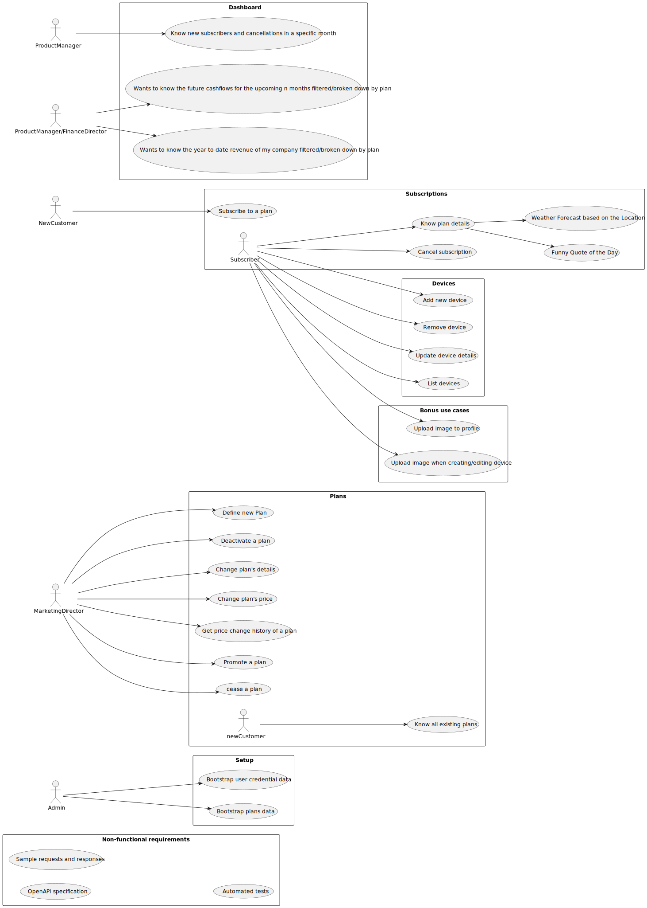

# Use Case Diagram (UCD)

# Use Cases / User Stories
Phase one

| WP_UC/US     | Description                                                                                                                                                                                                                                                                                                                                             |
|:-------------|:--------------------------------------------------------------------------------------------------------------------------------------------------------------------------------------------------------------------------------------------------------------------------------------------------------------------------------------------------------|
| WP #0 - Setup | As admin I want to “bootstrap” user credential data As admin I want to “bootstrap” plans data                                                                                                                                                                                                                                                           |
| WP#1A – Plans | As Marketing director, I want to define a new Plan detailing the monthly and annual cost, the maximum number of devices and other characteristics of the plan - As marketing director, I want to deactivate a plan As marketing director, I want to change a plan’s details other than pricing - As a new customer I want to know all existing plans |
| WP#2A – Subscriptions | As a new customer I want to subscribe to a plan - As subscriber I want to cancel my subscription - As subscriber I want to know the details of my plan                                                                                                                                                                                                  |
| WP#3A - Dashboard | As Product Manager I want to know how many new subscribers and cancelations occurred in a specific month                                                                                                                                                                                                                                                |
| WP#4A – Devices | As subscriber I want to add a new device to my subscription - As subscriber I want to remove a device from my subscription - As subscriber I want to update the details of my device (name and description) - As subscriber I want to list my devices                                                                                                   |
| Bonus use cases | Subscriptions - As subscriber I want to upload an image to my profile - Device - As subscriber I want to upload an image when creating/editing a device                                                                                                                                                                                                 |
| Non-functional requirements | OpenAPI specification - Sample requests and responses, e.g., POSTMAN collection - Automated tests, e.g., POSTMAN collection                                                                                                                                                                                                                             |

Phase two

| WP_UC/US | Description                                                                                                                                                                                                                                                          |
|:---------|:---------------------------------------------------------------------------------------------------------------------------------------------------------------------------------------------------------------------------------------------------------------------|
|WP#1B – Plans       | As marketing director, I want to promote a plan     - As marketing director, I want to cease a plan                                                                                                                                                                  |
|WP#2B – Subscriptions       | As subscriber I want to switch my plan (upgrade/downgrade) - As subscriber I want to renew my annual subscription  - As marketing director, I want to migrate all subscribers of a certain plan to a different plan                                                  |
|WP#3B - Dashboard   | As Product Manager or Financial director, I want to know the future cashflows for the upcoming n months filtered/broken down by plan  - As Product Manager or Financial director, I want to know the year-to-date revenue of my company filtered/broken down by plan |
|WP#4B – Plans       | As marketing director, I want to change the pricing of a plan   - As marketing director, I want to know the price change history of a plan                                                                                                                           |
|  Non-functional requirements        | All authenticated requests must use JWT    - OpenAPI specification -Sample requests and responses, e.g., POSTMAN collection -Automated tests, e.g., POSTMAN collection - Long result lists must support pagination                                                                                            ||
| Bonus use cases | Augment the subscription profile with a weather forecast based on the location of the subscriber - Augment the subscription profile with a funny quote of the day                                                                                                    |

