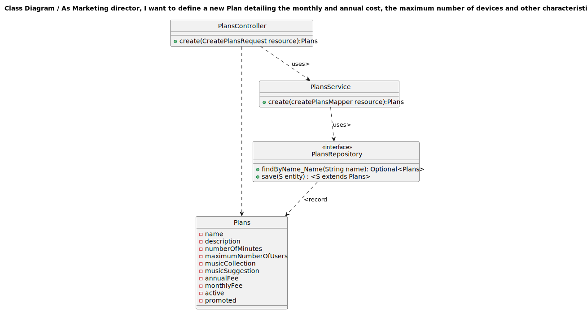

## 1. Requirements Engineering

### 1.1. User Story Description

As marketing director, I want to deactivate a plan

### 1.2. Customer Specifications and Clarifications 

**From the specifications document:**

A deactivated plan is one that no longer is available for subscription but remains inforce for current active subscribers of such plan.

**From the client clarifications:**

>Question:
>
>Boa noite,
>Gostaria de saber, relativamente à US04, se desativar um plano significa removê-lo do sistema ou não?

> Answer:
> bom dia,
>desativar um plano significa que esse plano já não está disponivel para novas subscrições, mas no entanto mantém-se em vigor para os clientes atuais do mesmo

### 1.3. Acceptance Criteria

All user stories have the following acceptance criteria:
* Analysis and design documentation
* OpenAPI specification
* POSTMAN collection with sample requests for all the use cases with tests

### 1.4. Found out Dependencies

* The plan needs to exist

### 1.5 Input and Output Data

**Input Data:**

* Typed data:
  * name of Plan
* Selected data:
  * n/a
  
**Output Data:**
  
* Success of operation - Plan is desaturated to new subversives
* In-success of operation - Error message that explains the mistake

### 1.6. System Sequence Diagram (SSD)

### 1.7 Other Relevant Remarks

## 2. OO Analysis

### 2.1. Relevant Domain Model Excerpt 

### 2.2. Other Remarks

n/a

## 3. Design - User Story Realization 

### 3.1. Rationale
n/a
### Systematization ##

According to the taken rationale, the conceptual classes promoted to software classes are:

* Plans
* Active
* AnnualFee
* Description
* MaximumNumberOfUsers
* MonthlyFee
* MusicCollection
* MusicSuggestion
* Name
* NumberOfMinutes
* Plans
* Promoted

Other software classes (i.e. Pure Fabrication) identified:
* PlansController
* PlansRepository
* PlansService
* PlansServiceImpl
* PlansViewMapper
* PlansView

## 3.2. Sequence Diagram (SD)

## 3.3. Class Diagram (CD)

# 4. Tests
Test starts with creating a new Plan. This Plan is set up to have be active.
Then we deactivate him using service function and verify result, in this case if active is not false.

    @ParameterizedTest
    @ValueSource(strings = { "Plan Name" })
    public void deactivateTest(String planName) {
    Plans plan = createPlan(planName, true);
    setupMockRepository(planName, plan);
    Plans plans1 = plansService.deactivate(planName, 0L);
    assertEquals(plan.getActive().getActive(),plans1.getActive().getActive());
    }

    @ParameterizedTest
    @ValueSource(strings = { "Invalid Plan" })
    public void deactivateTest_InvalidPlan(String planName) {
        when(plansRepository.findByName_Name(planName)).thenReturn(Optional.empty());

        assertThrows(IllegalArgumentException.class, () -> plansService.deactivate(planName, 0L));
    }

    @ParameterizedTest
    @ValueSource(strings = { "Invalid Plan" })
    public void deactivateTest_PlanAlreadyDeac(String planName) {
        Plans plan = createPlan(planName, false);
        setupMockRepository(planName, plan);
        assertThrows(IllegalArgumentException.class, () -> plansService.deactivate(planName, 0L));
    }
# 5. Observations

* To follow the principle of Information expert the Class Plans was divided in others 10 Classes. 

