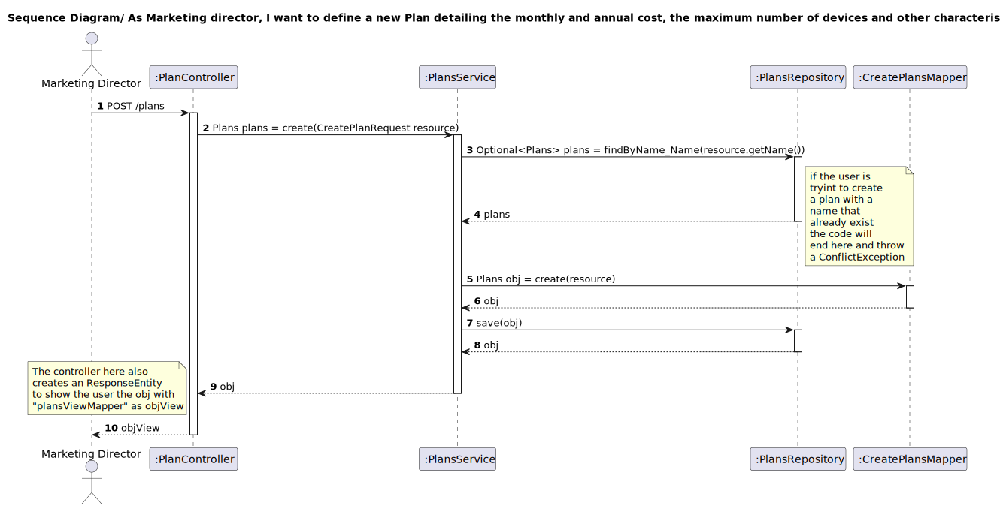

## 1. Requirements Engineering

### 1.1. User Story Description

As marketing director, I want to change a plan’s details other than pricing
### 1.2. Customer Specifications and Clarifications 

**From the specifications document:**

n/a

**From the client clarifications:**

>Question:
> 
> Boa tarde, na US6, quais devem ser as informações do plano que devem ser mostradas ao cliente?
>Assumo que sejam:
>-Preço Anual, Preço Mensal, Número de minutos, Nº Max Dispositivos, Nº Coleções musicas, Recomendações musicais
>Devo acrescentar algum?

> Answer:
> 
>boa tarde,
>deve também mostrar se é um plano promovido ou não

### 1.3. Acceptance Criteria

All user stories have the following acceptance criteria:
* Analysis and design documentation
* OpenAPI specification
* POSTMAN collection with sample requests for all the use cases with tests.

### 1.4. Found out Dependencies

* Plan needs to exist

### 1.5 Input and Output Data

**Input Data:**

* Typed data:
* description
* Music Suggestion
* Number of Minutes
* Maxinum Number of Users
* Music Collection
* Active
* Promoted

* Selected data:

* n/a
  
**Output Data:**

* Success of operation - Plan details will be updated
* In-success of operation - Error message that explains the mistake

### 1.6. System Sequence Diagram (SSD)

### 1.7 Other Relevant Remarks

## 2. OO Analysis

### 2.1. Relevant Domain Model Excerpt 

### 2.2. Other Remarks

n/a

## 3. Design - User Story Realization 

### 3.1. Rationale
n/a
### Systematization ##

According to the taken rationale, the conceptual classes promoted to software classes are:

* Plans
* Active
* AnnualFee
* Description
* MaximumNumberOfUsers
* MonthlyFee
* MusicCollection
* MusicSuggestion
* Name
* NumberOfMinutes
* Plans
* Promoted

Other software classes (i.e. Pure Fabrication) identified:
* PlansController
* PlansRepository
* PlansService
* EditPlansMapper
* PlansServiceImpl
* EditPlanRequest
* PlansViewMapper
* PlansView
## 3.2. Sequence Diagram (SD)

## 3.3. Class Diagram (CD)

# 4. Tests
Test stars with creating a Plan. Then creating a EditPlansRequest that haves the
info to update the plan. Update the plan using service function and then verify 
if plan changes where made.

        @Test
        public void partialUpdateTest() {

        EditPlansRequest request = new EditPlansRequest();
        request.setDescription("New Description");
        request.setActive(true);
        request.setPromoted(true);
        request.setMusicSuggestion("automatic");
        request.setMusicCollection(100);
        request.setNumberOfMinutes("10");
        request.setMaximumNumberOfUsers(10);

        Name name = new Name();
        name.setName("Gold");

        Description description = new Description();
        description.setDescription("Gold Description");

        NumberOfMinutes numberOfMinutes = new NumberOfMinutes();
        numberOfMinutes.setNumberOfMinutes("100");

        MaximumNumberOfUsers maximumNumberOfUsers = new MaximumNumberOfUsers();
        maximumNumberOfUsers.setMaximumNumberOfUsers(5);

        MusicCollection musicCollection = new MusicCollection();
        musicCollection.setMusicCollection(10);

        MusicSuggestion musicSuggestion = new MusicSuggestion();
        musicSuggestion.setMusicSuggestion("personalized");

        AnnualFee annualFee = new AnnualFee();
        annualFee.setAnnualFee(150.00);

        MonthlyFee monthlyFee = new MonthlyFee();
        monthlyFee.setMonthlyFee(15.00);

        Active active = new Active();
        active.setActive(true);

        Promoted promoted = new Promoted();
        promoted.setPromoted(false);

        Plans plan = new Plans(name, description, numberOfMinutes, maximumNumberOfUsers,
                musicCollection, musicSuggestion, annualFee, monthlyFee, active, promoted);

        when(plansRepository.findByName_Name(plan.getName().getName())).thenReturn(Optional.of(plan));
        when(plansRepository.save(Mockito.any(Plans.class))).thenReturn(plan);

        Plans result = plansService.partialUpdate(plan.getName().getName(), request, 0L);

        when(plansRepository.save(Mockito.any(Plans.class))).thenReturn(plan);

        assertNotNull(result);
        assertEquals("Gold", result.getName().getName());
        assertEquals("New Description", result.getDescription().getDescription());
        assertEquals(true, result.getActive().getActive());
        assertEquals(true, result.getPromoted().getPromoted());
        assertEquals("automatic", result.getMusicSuggestion().getMusicSuggestion());
        assertEquals(100, result.getMusicCollection().getMusicCollection());
        assertEquals("10", result.getNumberOfMinutes().getNumberOfMinutes());
        assertEquals(10, result.getMaximumNumberOfUsers().getMaximumNumberOfUsers());

    }

    @Test
    public void promoteTest_PlanDoesNotExist() {
        EditPlansRequest editPlansRequest = new EditPlansRequest();
        String planName = "promoteTest_PlanDoesNotExist";
        assertThrows(IllegalArgumentException.class, () -> plansService.partialUpdate(planName, editPlansRequest,0L));
    }

# 5. Observations

* To follow the principle of Information expert the Class Plans was divided in others 10 Classes. 

