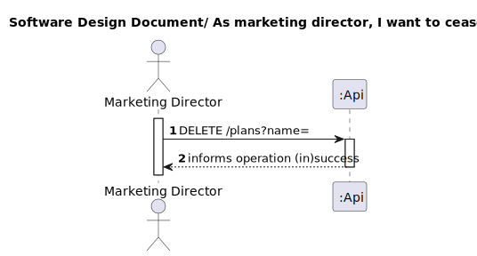

# UC20 – To cease a plan
## 1. Requirements Engineering

### 1.1. User Story Description

As marketing director, I want to cease a plan

### 1.2. Customer Specifications and Clarifications 

**From the specifications document:**

>Plans can also be deactivated or ceased.

**From the client clarifications:**

>Question:
Na US 21(As marketing director, I want to cease a plan.), o cliente pretende apagar o plano completamente?
Se sim, pode-se apagar com subscrições ainda relacionadas ao plano que pretende realizar "cease"?

> Answer:
pretende-se que o plano seja considerado como "arquivado" deixando de aparecer nas listagens e dashboards. apenas se pode arquivar um plano que esteja inativo e que já não tenha subscrições

### 1.3. Acceptance Criteria

All user stories have the following acceptance criteria:
* Analysis and design documentation
* OpenAPI specification
* POSTMAN collection with sample requests for all the use cases with tests.

### 1.4. Found out Dependencies

* UC2 - As admin I want to “bootstrap” plans data. 
* UC3 - As Marketing director, I want to define a new Plan detailing the monthly and annual cost, 
the maximum number of devices and other characteristics of the plan. 
* UC4 - As marketing director, I want to deactivate a plan

### 1.5 Input and Output Data

**Input Data:**

* Typed data:

  * name

* Selected data:

    * n/a
  
**Output Data:**

* Success of operation - Shows OK operation status
* In-success of operation - Error message that explains the mistake

### 1.6. System Sequence Diagram (SSD)

### 1.7 Other Relevant Remarks

## 2. OO Analysis

### 2.1. Relevant Domain Model Excerpt 

### 2.2. Other Remarks

n/a

## 3. Design - User Story Realization 

### 3.1. Rationale
n/a
### Systematization ##

According to the taken rationale, the conceptual classes promoted to software classes are:

* Plans
* Active
* AnnualFee
* Description
* MaximumNumberOfUsers
* MonthlyFee
* MusicCollection
* MusicSuggestion
* Name
* NumberOfMinutes
* Promoted
* FeeRevision
* Deleted

Other software classes (i.e. Pure Fabrication) identified:
* PlansController
* PlansRepository
* PlansService
* PlansServiceImpl
* PlanViewMapper
* SubscriptionsRepository

## 3.2. Sequence Diagram (SD)

## 3.3. Class Diagram (CD)

# 4. Tests
* Repository test

      @Test
      void testFindByName() {
      // Mock the repository method
      Plans plan = createPlan("Plan Name");
      when(plansRepository.findByName_Name("Plan Name")).thenReturn(Optional.of(plan));

        // Call the method
        Optional<Plans> result = plansRepository.findByName_Name("Plan Name");

        // Verify the result
        assertEquals(Optional.of(plan), result);
        verify(plansRepository).findByName_Name("Plan Name");
      }

      @Test
      void testFindByActive() {
      Plans plan = createPlan("Plan Name");
      when(plansRepository.findByName_Name("Plan Name")).thenReturn(Optional.of(plan));
      when(plansRepository.save(Mockito.any(Plans.class))).thenReturn(plan);
      plansRepository.save(plan);
      Iterable<Plans> result = plansRepository.findByActive_Active(true);
      assertEquals(plan, result);
      verify(plansRepository).findByActive_Active(true);
      }

      @Test
      void testCeaseByPlan() {
        // Create a sample plan
        Plans plan = createPlan("Plan Name");

        // Mock the repository method
        when(plansRepository.ceaseByPlan(plan, 1L)).thenReturn(1);

        // Call the method
        int result = plansRepository.ceaseByPlan(plan, 1L);

        // Verify the result
        assertEquals(1, result);
        verify(plansRepository).ceaseByPlan(plan, 1L);
      }

* Service test

      @ParameterizedTest
      @ValueSource(strings = { "Plan Name" })
      public void ceaseTest(String planName) {
      Plans plan = createPlan(planName, false, false);
      setupMockRepository(planName, plan, false);

        int result = plansService.cease(planName, 0L);

        assertEquals(1, result);
        verify(plansRepository).ceaseByPlan(plan, 0L);
      }

      @ParameterizedTest
      @ValueSource(strings = { "Invalid Plan" })
      public void ceaseTest_InvalidPlan(String planName) {
      when(plansRepository.findByName_Name(planName)).thenReturn(Optional.empty());

        assertThrows(EntityNotFoundException.class, () -> plansService.cease(planName, 0L));
      }

      @ParameterizedTest
      @ValueSource(strings = { "Active Plan", "Promoted Plan" })
      public void ceaseTest_ActiveOrPromotedPlan(String planName) {
      Plans plan = createPlan(planName, true, true);
      setupMockRepository(planName, plan, false);

        assertThrows(IllegalArgumentException.class, () -> plansService.cease(planName, 0L));
      }

      @ParameterizedTest
      @ValueSource(strings = { "Plan with Subscriptions" })
      public void ceaseTest_ActiveSubscriptions(String planName) {
      Plans plan = createPlan(planName, false, false);
      setupMockRepository(planName, plan, true);

        assertThrows(IllegalArgumentException.class, () -> plansService.cease(planName, 0L));
      }

# 5. Observations

* To follow the principle of Information expert the Class Plans was divided in others 11 Classes. 

