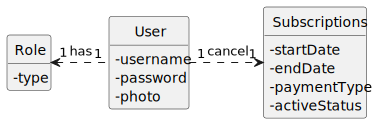

WP#2A – Subscriptions

## 1. Requirements Engineering

### 1.1. User Story Description

As subscriber I want to cancel my subscription

### 1.2. Customer Specifications and Clarifications 

**From the specifications document:**

n/a

**From the client clarifications:**

**1st Question**

>Question: O cancelamento de uma subscrição implica ou não removê-la do sistema?

> Answer: O cancelamento de uma subscrição implica que o utilizador deixa de ter acesso ao serviço. o sistema deve manter a informação da conta durante 30 dias caso o cliente a pretenda reativar. após esse período todos os dados pessoais devem ser anonimizados mas a restante informação mantida para efeitos estatisticos

**2nd Question**

>Question: Gostaria de saber se um cliente que queira anular a sua subscrição precisa de dar alguma confirmação, como introduzir a password, por exemplo.

> Answer: Não é necessário, essa confirmação é da responsabilidade da aplicação de UI que não faz parte do âmbito do projeto

### 1.3. Acceptance Criteria

All user stories have the following acceptance criteria:
* Analysis and design documentation
* OpenAPI specification
* POSTMAN collection with sample requests for all the use cases with tests
* Proper handling of concurrent access.

### 1.4. Found out Dependencies

* User

### 1.5 Input and Output Data

**Input Data:**

* Typed data:
* Selected data:
  * Subscription
  
**Output Data:**

* (In)Success of operation

### 1.6. System Sequence Diagram (SSD)

### 1.7 Other Relevant Remarks

## 2. OO Analysis

### 2.1. Relevant Domain Model Excerpt 

### 2.2. Other Remarks

n/a

## 3. Design - User Story Realization 

### 3.1. Rationale
n/a
### Systematization ##

According to the taken rationale, the conceptual classes promoted to software classes are:
* Subscriptions
Other software classes (i.e. Pure Fabrication) identified: 
* SubscriptionsController
* SubscriptionsRepository
* UserRepository
* SubscriptionsService
* SubscriptionsServiceImpl

## 3.2. Sequence Diagram (SD)

## 3.3. Class Diagram (CD)

# 4. Tests

n/a

# 5. Observations

n/a

