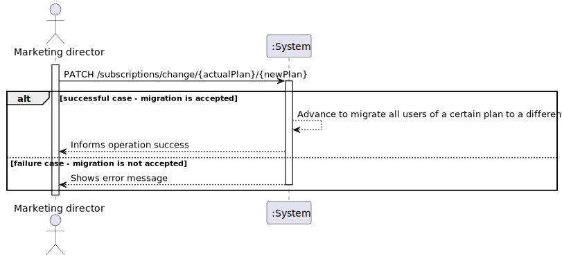
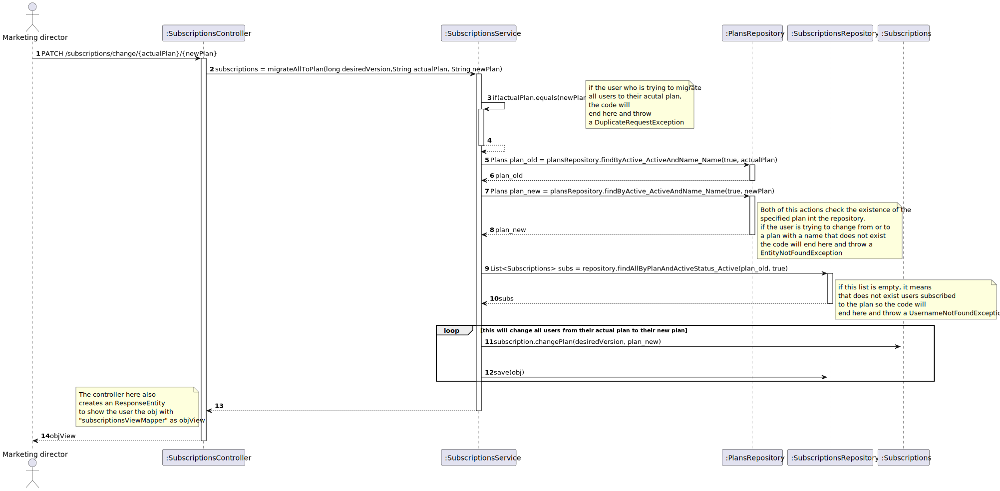

WP#2B – Subscriptions

## 1. Requirements Engineering

### 1.1. User Story Description

As marketing director, I want to migrate all subscribers of a certain plan to a different plan

### 1.2. Customer Specifications and Clarifications 

**From the specifications document:**

A customer can subscribe to the service by selecting a plan and paying for the annual or monthly fee.

**From the client clarifications:**

**1st Question**

>Question: Quando o plano do cliente é mudado, devemos apagar os devices previamente associados, sendo necessário introduzi-los outra vez ou devemos migrá-los para a nova subscrição? Uma vez que caso o plano reduza o numero max de dispositivos, poderá não ser possível manter todos os que já se encontravam associados a subscrição. Se não apagarmos os devices da subscrição, como escolhemos quais devem permanecer caso haja uma redução do número máximo dos mesmos?

> Answer: Se o novo plano não permtiir mante ro mesmo número de dispositivos que o cliente tem atualmente não deve ser possivel realizar a troca de plano. o cliente trá que primeiro remover alguns dos seus dispositivos e depois efetuar a troca de plano

**2nd Question**

>Question: Mas na migração realizada pelo marketing director, devemos eliminar os dispositivos do utilizador automaticamente caso o seu número seja superior ao permitido pelo novo plano? Uma vez que não seria possivel ao cliente eliminar ele os dispositivos antes da mudança de plano, uma vez que não foi ele que fez o pedido

> Answer: Cliente não respondeu

### 1.3. Acceptance Criteria

All user stories have the following acceptance criteria:
* Analysis and design documentation
* OpenAPI specification
* POSTMAN collection with sample requests for all the use cases with tests
* Proper handling of concurrent access.

### 1.4. Found out Dependencies

* Plan
* User

### 1.5 Input and Output Data

**Input Data:**

* Typed data:
* Selected data:
  * Plan
  * User
  
**Output Data:**

* (In)Success of operation

### 1.6. System Sequence Diagram (SSD)

### 1.7 Other Relevant Remarks

## 2. OO Analysis

### 2.1. Relevant Domain Model Excerpt 

### 2.2. Other Remarks

n/a

## 3. Design - User Story Realization 

### 3.1. Rationale
n/a
### Systematization ##

According to the taken rationale, the conceptual classes promoted to software classes are:
* ActiveStatus
* EndDate
* PaymentType
* StartDate
* Subscriptions
Other software classes (i.e. Pure Fabrication) identified: 
* SubscriptionsController
* SubscriptionsRepository
* PlansRepository
* SubscriptionsService
* SubscriptionsServiceImpl

## 3.2. Sequence Diagram (SD)

## 3.3. Class Diagram (CD)

# 4. Tests

n/a

# 5. Observations

To follow the principle of Information expert the Class Subscriptions was divided in others 4 Classes. 

