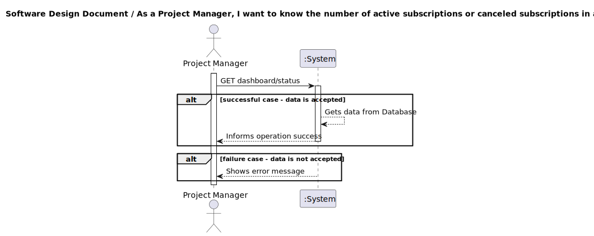
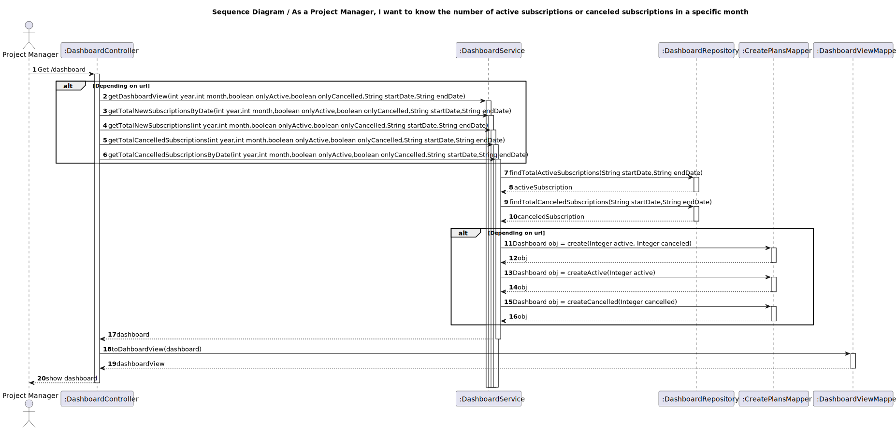
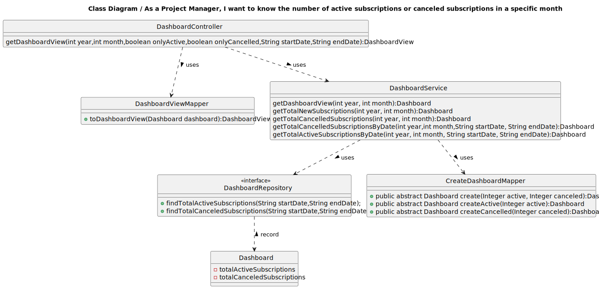

## 1. Requirements Engineering

### 1.1. User Story Description

As Product Manager I want to know how many new subscribers and cancellations occurred in a specific month.

### 1.2. Customer Specifications and Clarifications 

**From the specifications document:**

It should show how many new or cancelled subscriptions occurred in a specific month .

**From the client clarifications:**

>Question:
>
>Boa tarde. O staff poderá escolher ver as subscrições e os cancelamentos individualmente, ou deverão ser mostrados os dois juntos?

> Answer:
>pretende-se que o retorno deste serviço seja uma estrutura de dados que possa trazer toda a informação desejada pelo utilizador, o que implica que será possivel consultar essas duas informações em simultaneo. deve no entanto ser possivel filtrar essa informação para indicar ao serviço que apenas se pretende uma delas e entre que datas

>Question:
>Quais são os critérios de aceitação para saber quantos subscribers e cancellations ocorreram num mês específico. Há algumas informações/dados em especifico que devo ter mais atenção?

>Answer:

> subscritor 123 cancelou a sua subscrição

>novo subscritor 456

>novo subscritor 457

>o dashboard deve mostrar:

>cancelamentos: 1

>novas subscrições: 2

>Question:Boa tarde, no que diz respeito à informação que é recebida, podemos apresentar apenas o número de subscrições novas e canceladas ou devemos também indicar quais planos foram subscritos ou cancelados no mês especificado pelo utilizador.

>Answer: basta indicarem as quantidades

>Question:As pesquisas feitas pelo Project Manager da Dashboard são para ser guardadas?

>Answer:não

> Uma renovaçao de uma subscriçao pode ser considerada uma nova subscriçao?Se não como fazemos a distinção de novos subscritores e de subscritores que renovam a sua subscriçao

>Answer: pretende-se distinguir novas subscrições de renovações. Como tal para cada subscrição é necessário saber a data em que foi subscrita e a última data em que foi renovada.

 
 
 
 

### 1.3. Acceptance Criteria

All user stories have the following acceptance criteria:
* Analysis and design documentation
* OpenAPI specification
* POSTMAN collection with sample requests for all the use cases with tests

### 1.4. Found out Dependencies

* There is a existing dependence with the subscription,to be able to show data it needs to exist a subscription

### 1.5 Input and Output Data

**Input Data:**

* Typed data:
  * year
  * month
  * Start Date
  * End Date
  * onlyCancelled
  * onlyActive
* Selected data:
  * Subscription startDate
  * Subscription endDate
  * Subscription status
  
**Output Data:**
  
* Success of operation - Dashboard is desaturated to new subversives
* In-success of operation - Error message that explains the mistake

### 1.6. System Sequence Diagram (SSD)

### 1.7 Other Relevant Remarks

## 2. OO Analysis

### 2.1. Relevant Domain Model Excerpt 

### 2.2. Other Remarks

n/a

## 3. Design - User Story Realization 

### 3.1. Rationale
n/a
### Systematization ##

According to the taken rationale, the conceptual classes promoted to software classes are:

* Dashboard
* TotalActiveSubscription
* TotalCanceledSubscriptions

Other software classes (i.e. Pure Fabrication) identified:
* DashboardController
* DashboardRepository
* DashboardService
* DashboardServiceImpl
* DashboardViewMapper
* DashboardView
* CreateDashboardMapper

## 3.2. Sequence Diagram (SD)

## 3.3. Class Diagram (CD)

# 4. Tests
      @Test
      public void testDashboardCreation() {
      Integer totalActiveSubscriptions = 100;
      Integer totalCanceledSubscriptions = 20;
      Double totalRevenue = 1500.0;
      String planName = "Gold";
      String month = "January";

        Dashboard dashboard = new Dashboard(totalActiveSubscriptions, totalCanceledSubscriptions, totalRevenue, planName, month);

        Assertions.assertEquals(totalActiveSubscriptions, dashboard.getTotalActiveSubscriptions().getTotalActiveSubscriptions());
        Assertions.assertEquals(totalCanceledSubscriptions, dashboard.getTotalCanceledSubscriptions().getTotalCanceledSubscriptions());
        Assertions.assertEquals(totalRevenue, dashboard.getTotalRevenue().getTotalRevenue());
        Assertions.assertEquals(planName, dashboard.getPlanName().getPlanName());
        Assertions.assertEquals(month, dashboard.getMonth().getMonth());
      }
# 5. Observations

* To follow the principle of Information expert the Class Dashboard was divided in others 2 Classes. 

