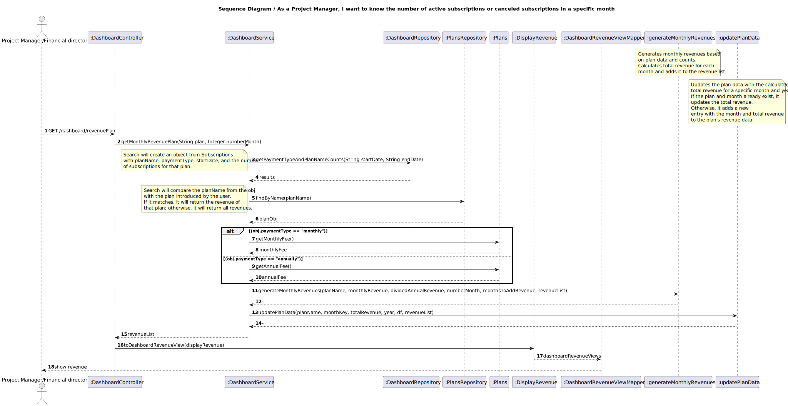
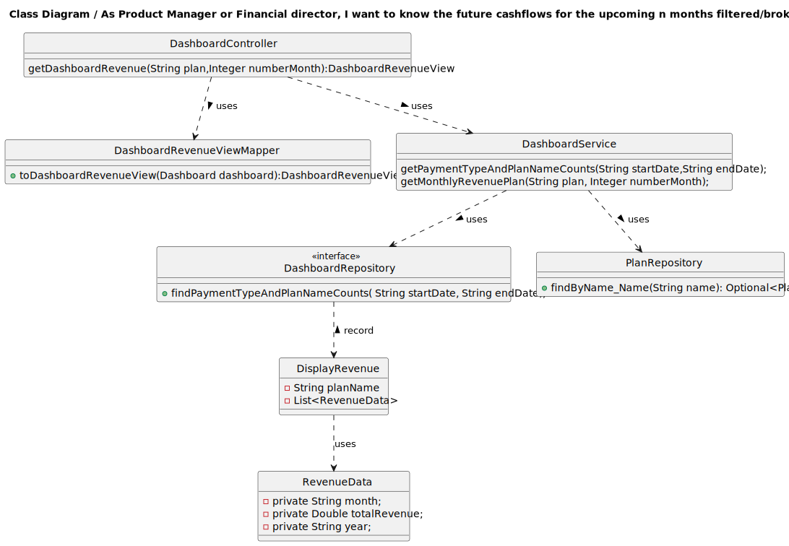

## 1. Requirements Engineering

### 1.1. User Story Description

As Product Manager or Financial director, I want to know the future cashflows for the upcoming n months filtered/broken down by plan
### 1.2. Customer Specifications and Clarifications 

**From the specifications document:**

The cash flow map is a timeline-based listing of the cash the company has received/will receive per month,
on the last/upcoming n months. For instance, a future cash flow map, assuming the current monthly
subscribers will remain, and the annual subscribers will not renew.

**From the client clarifications:**

>Question:Boa tarde, O filtro por plano num pedido de cashflow em n meses pode ser nulo (ou seja calcular o cashflow para todos os planos) ou é sempre necessário filtrar por um plano em especifico ?

>Answer:boa tarde, o filtro por plano deve ser opcional. nesse caso deverá apresentar todos os planos
 
>Question:O filtro por plano num pedido de cashflow em n meses pode ser nulo (ou seja calcular o cashflow para todos os planos) ou é sempre necessário filtrar por um plano em especifico ?

>Answer:o filtro por plano deve ser opcional. nesse caso deverá apresentar todos os planos

>Question:Boa tarde, Existe algum número máximo de meses para um pedido de cashflow ?

>Answer: Não respondeu

>Question: Boa noite, Num pedido de cashflow da dashboard é suposto retornar a soma do cashflow de n meses seguintes ou é suposto retornar o cashflow de cada mês separadamente? 

>Answer: Não respondeu

### 1.3. Acceptance Criteria

All user stories have the following acceptance criteria:
* Analysis and design documentation
* OpenAPI specification
* POSTMAN collection with sample requests for all the use cases with tests

### 1.4. Found out Dependencies

* There is a existing dependence with the subscription and Plan.
* We must know the subscription planName so that we can get the plan.
* We must know the subscription paymentType so that we can get the type of Fee monthly or annually.

### 1.5 Input and Output Data

**Input Data:**

* Typed data:
  * String planName
  * Integer numberMonth
* Selected data:
  * Subscription startDate
  * Subscription endDate
  * Plan name;
  * Plan monthlyFee
  * Plan annualFee
  
**Output Data:**
  
* Success of operation - DisplayRevenue is desaturated to new subversives
* In-success of operation - Error message that explains the mistake

### 1.6. System Sequence Diagram (SSD)

### 1.7 Other Relevant Remarks

* N/A

## 2. OO Analysis

### 2.1. Relevant Domain Model Excerpt 

### 2.2. Other Remarks

DisplayRevenue is a Array list  composed by 2 parameters:

* List<RevenueData>
* planName

## 3. Design - User Story Realization 

### 3.1. Rationale

* N/A

### Systematization ##

According to the taken rationale, the conceptual classes promoted to software classes are:

* RevenueData
* DisplayRevenue

Other software classes (i.e. Pure Fabrication) identified:
* DashboardController
* DashboardRepository
* DashboardService
* DashboardServiceImpl
* PlanRepository
* DashboardRevenueViewMapper
* DashboardRevenueView

## 3.2. Sequence Diagram (SD)

## 3.3. Class Diagram (CD)

# 4. Tests

To group by planName,paymentType,startDate and number of subscriptions:

    public void testFindPaymentTypeAndPlanNameCounts() {
    String startDate = "2023-01-01";
    String endDate = "2023-01-31";
    List<Object[]> mockedResult = new ArrayList<>();
    Object[] resultRow1 = {"monthly", "Gold", "2023-01-01", 10};
    Object[] resultRow2 = {"monthly", "Silver", "2023-01-01", 5};
    mockedResult.add(resultRow1);
    mockedResult.add(resultRow2);

        when(dashboardRepository.findPaymentTypeAndPlanNameCounts(startDate, endDate)).thenReturn(mockedResult);
        List<Object[]> result = dashboardRepository.findPaymentTypeAndPlanNameCounts(startDate, endDate);

        assertEquals(2, result.size());

        Object[] row1 = result.get(0);
        assertEquals("monthly", row1[0]);
        assertEquals("Gold", row1[1]);
        assertEquals("2023-01-01", row1[2]);
        assertEquals(10, row1[3]);

        Object[] row2 = result.get(1);
        assertEquals("monthly", row2[0]);
        assertEquals("Silver", row2[1]);
        assertEquals("2023-01-01", row2[2]);
        assertEquals(5, row2[3]);
    }

To test the future cashflow by n month

    @Test
    public void testGetMonthlyRevenuePlan() {
        // Initialize mocks
        MockitoAnnotations.openMocks(this);

        // Set up test data
        String planName = "Gold";
        Double annualFee = 100.00;
        Double monthlyFee = 10.00;

        Plans plan = createPlan(planName, annualFee, monthlyFee);
        Integer numberMonth = 3;

        LocalDate now = LocalDate.now();
        LocalDate startDate = now.minusYears(1);
        LocalDate endDate = now;
        String startDateString = startDate.toString();
        String endDateString = endDate.toString();

        List<Object[]> results = new ArrayList<>();
        Object[] row1 = {"monthly", planName, startDateString, 2L};
        Object[] row2 = {"annually", planName, startDateString, 1L};
        results.add(row1);
        results.add(row2);

        when(plansRepository.findByName_Name(planNameCaptor.capture())).thenReturn(Optional.of(plan));

        List<DisplayRevenue> revenueList = dashboardService.getMonthlyRevenuePlan(planName, numberMonth);

        verify(plansRepository, times(2)).findByName_Name(planNameCaptor.capture());
        verifyMonthlyRevenue(planName, 2, monthlyFee * 2, 0.0, revenueList);
        verifyMonthlyRevenue(planName, 2, 0.0, annualFee, revenueList);

        Assertions.assertEquals(2, planNameCaptor.getAllValues().size());
        Assertions.assertEquals(planName, planNameCaptor.getAllValues().get(0));
        Assertions.assertEquals(planName, planNameCaptor.getAllValues().get(1));
    }

# 5. Observations

* N/A

