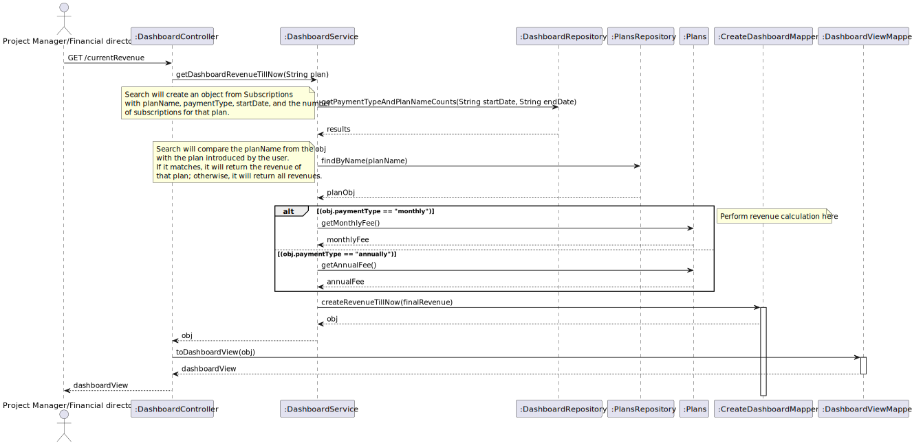
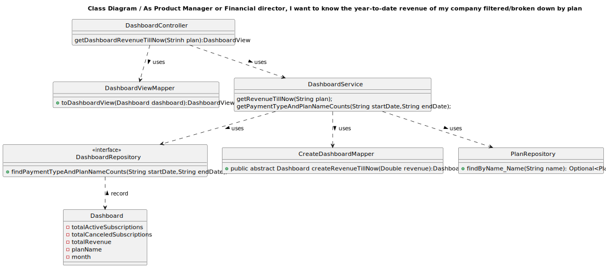

## 1. Requirements Engineering

### 1.1. User Story Description

As Product Manager or Financial director, I want to know the year-to-date revenue of my
company filtered/broken down by plan

### 1.2. Customer Specifications and Clarifications 

**From the specifications document:**

* All the revenue generated so far

**From the client clarifications:**

>Question:Boa tarde , gostava de saber na US26 quais informacões devem ser apresentadas ao cliente. Tb gostava de saber se apenas o cliente tem que por o ano que quer ver essas informacões ou se é do ano em que está atualmente , a começar em janeiro até á data que se encontra. Desde já obrigado!

>Answer:deve ser apresentada a receita proveniente das subscrições, devidamente subdividida por plano. apenas do ano corrente

>Question:Boa tarde, Na US 26 é apenas pedido o rendimento do ano atual até à data atual(01/01/2023-01/06/2023) ou é necessário o utilizador especificar um ano para começar a calcular os rendimentos(01/01/2020-01/06/2023)?

>Answer:boa tarde, apenas do ano atual

>Boa noite. Na US026, temos que apresentar o "revenue" para "ceased plans"? Obrigado 

>Answer: Não respondeu
### 1.3. Acceptance Criteria

All user stories have the following acceptance criteria:
* Analysis and design documentation
* OpenAPI specification
* POSTMAN collection with sample requests for all the use cases with tests

### 1.4. Found out Dependencies

* There is a existing dependence with the subscription and Plan.
* We must know the subscription planName so that we can get the plan.
* We must know the subscription paymentType so that we can get the type of Fee monthlu or annualy.

### 1.5 Input and Output Data

**Input Data:**

* Typed data:
  * Plan name
* Selected data:
  * Subscription startDate
  * Subscription endDate
  * Subscription status
  * Plan name;
  * Plan monthlyFee
  * Plan annualFee
  
**Output Data:**
  
* Success of operation - Dashboard is desaturated to new subversives
* In-success of operation - Error message that explains the mistake

### 1.6. System Sequence Diagram (SSD)

### 1.7 Other Relevant Remarks

* N/A
## 2. OO Analysis

### 2.1. Relevant Domain Model Excerpt 

### 2.2. Other Remarks

* N/A
## 3. Design - User Story Realization 

### 3.1. Rationale

* N/A

### Systematization ##

According to the taken rationale, the conceptual classes promoted to software classes are:

* Dashboard
* TotalRevenue

Other software classes (i.e. Pure Fabrication) identified:
* DashboardController
* DashboardRepository
* PlansRepository
* DashboardService
* DashboardServiceImpl
* DashboardViewMapper
* DashboardView
* CreateDashboardMapper

## 3.2. Sequence Diagram (SD)

## 3.3. Class Diagram (CD)

# 4. Tests
To group by planName,paymentType,startDate and number of subscriptions:

    public void testFindPaymentTypeAndPlanNameCounts() {
    String startDate = "2023-01-01";
    String endDate = "2023-01-31";
    List<Object[]> mockedResult = new ArrayList<>();
    Object[] resultRow1 = {"monthly", "Gold", "2023-01-01", 10};
    Object[] resultRow2 = {"monthly", "Silver", "2023-01-01", 5};
    mockedResult.add(resultRow1);
    mockedResult.add(resultRow2);

        when(dashboardRepository.findPaymentTypeAndPlanNameCounts(startDate, endDate)).thenReturn(mockedResult);
        List<Object[]> result = dashboardRepository.findPaymentTypeAndPlanNameCounts(startDate, endDate);

        assertEquals(2, result.size());

        Object[] row1 = result.get(0);
        assertEquals("monthly", row1[0]);
        assertEquals("Gold", row1[1]);
        assertEquals("2023-01-01", row1[2]);
        assertEquals(10, row1[3]);

        Object[] row2 = result.get(1);
        assertEquals("monthly", row2[0]);
        assertEquals("Silver", row2[1]);
        assertEquals("2023-01-01", row2[2]);
        assertEquals(5, row2[3]);
    }

To test revenue till now:

    @Test
    void testGetRevenueTillNow() {
        Plans goldPlan = createPlan("Gold",100.00,100.00);

        when(plansRepository.findByName_Name("Gold")).thenReturn(Optional.of(goldPlan));

        List<Object[]> results = new ArrayList<>();
        Object[] row1 = {"monthly", "Gold", 2L};
        Object[] row2 = {"annually", "Gold", 3L};
        results.add(row1);
        results.add(row2);

        Dashboard result = dashboardService.getRevenueTillNow("Gold");

        verify(plansRepository).findByName_Name("Gold");

        Double expectedRevenue = (2 * 100.0) + (3 * 1000.0);
        assertEquals(expectedRevenue, result.getTotalRevenue().getTotalRevenue().doubleValue());

    }
# 5. Observations

* To follow the principle of Information expert the Class Dashboard was divided in others 5 Classes. 

