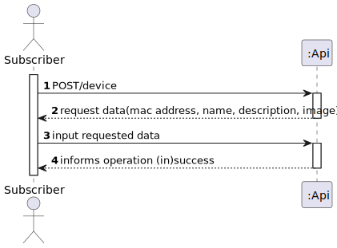
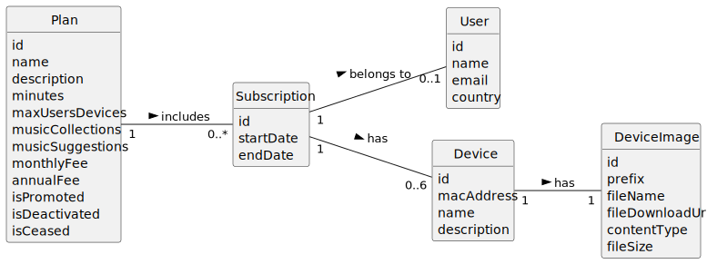
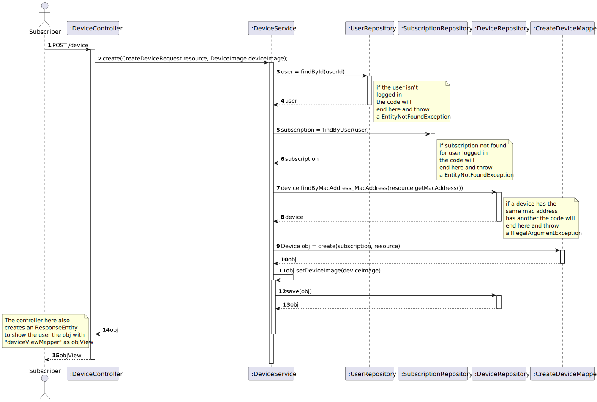
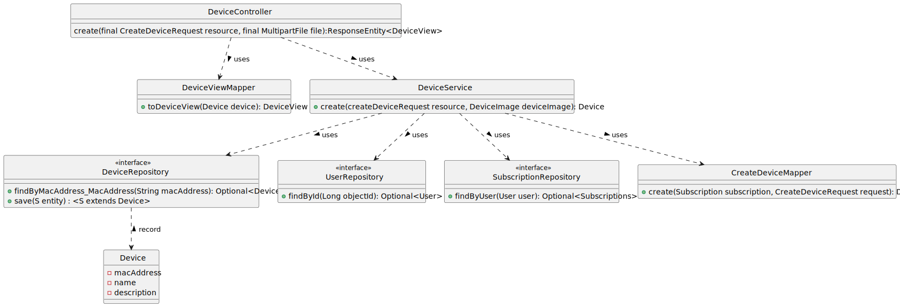

# UC11 – To add a new device to my subscription

## 1. Requirements Engineering

### 1.1. User Story Description

As subscriber, I want to add a new device to my subscription.

### 1.2. Customer Specifications and Clarifications 

**From the specifications document:**
>A customer can subscribe to the service by selecting a plan and paying for the annual or monthly fee. This
entitles the customer to listen to up to n minutes of music on the number of devices according to the plan
they selected.

**From the client clarifications:**

> Question: Numa pergunta anterior, referiu que o utilizador necessita de inserir o MAC address e a designação do dispositivo.
> Na US 13 - (As subscriber I want to update the details of my device (name and description)), o "name" e a "description" referem-se ao MAC address e a designação respetivamente?
> 
> Answer: "MAC address" é o endereço da placa de rede do dispositivo: https://en.wikipedia.org/wiki/MAC_address
> 
> "name" é o nome que o tulizador dá ao dispositivo, ex., "TV 1 sala"
> 
> "description" é um texto que o utilizaod rpode introiduzir para descrever melhor o dispositivo, ex., "TV grande na parede da sala"
>
> Question: Sendo assim, poderia especificar os critérios de aceitação dos mesmos e ainda mencionar se são obrigatórios ou opcionais na criação e na atualização de um dispositivo?
> 
> Answer: o "MAC address" é obrigatório e deve ser um endereço MAC válido.
> 
> a designação é obrigatória, sendo um conjunto alfanumérico com um máximo de 50 caracteres.
> 
> a imagem é opcional e pode ser em qualquer formato standard de imagem (jpg, png, ...)
> 
> 
> 
### 1.3. Acceptance Criteria

* Analysis and design documentation
* OpenAPI specification
* POSTMAN collection with sample requests for all the use cases with tests
* Proper handling of concurrent access

### 1.4. Found out Dependencies

* UC7 - "As a new customer I want to subscribe to a plan". 
A customer must already had subscribed to a plan beforehand

### 1.5 Input and Output Data

**Input Data:**

* Typed data:
  * mac address
  * name
  * description 
  * image (optional)
* Selected data:
  * n/a
  
**Output Data:**

* (In)Success of operation

### 1.6. System Sequence Diagram (SSD)

### 1.7 Other Relevant Remarks

n/a

## 2. OO Analysis

### 2.1. Relevant Domain Model Excerpt 

### 2.2. Other Remarks

n/a

## 3. Design - User Story Realization 

### 3.1. Rationale
n/a
### Systematization ##

According to the taken rationale, the conceptual classes promoted to software classes are:

* Device
* DeviceImage
* Plan
* Subscription
* User

Other software classes (i.e. Pure Fabrication) identified:

* DeviceController
* DeviceRepository
* DeviceService
* DeviceServiceImpl
* CreateDeviceRequest
* DeviceViewMapper
* DeviceView

## 3.2. Sequence Diagram (SD)

First model:

## 3.3. Class Diagram (CD)

**Note: private attributes and/or methods were omitted.**

# 4. Tests
* n/a
# 5. Observations
* n/a 

