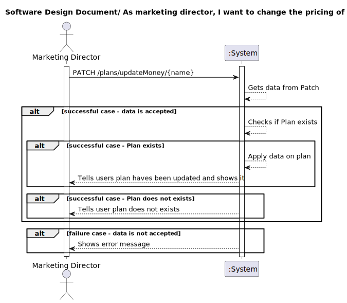
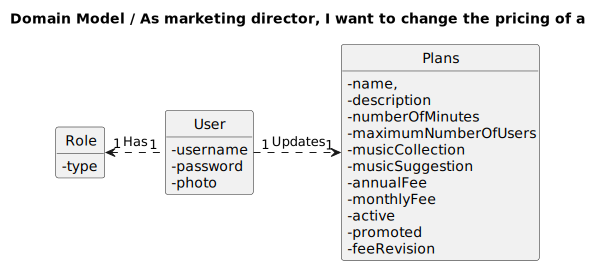
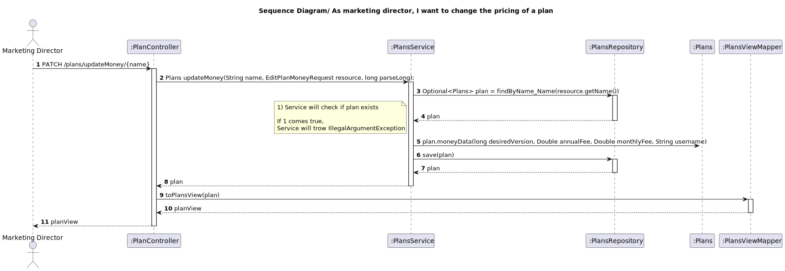
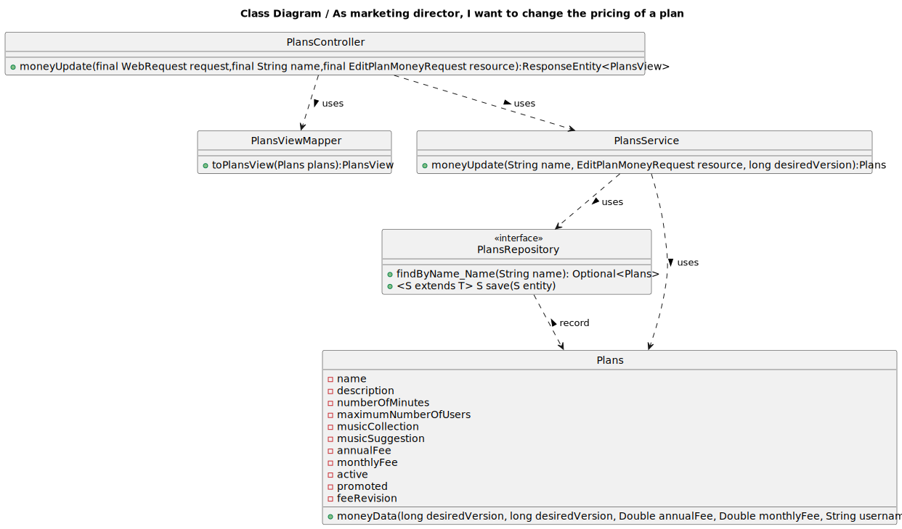

## 1. Requirements Engineering

### 1.1. User Story Description

As marketing director, I want to know the price change history of a plan

### 1.2. Customer Specifications and Clarifications 

**From the specifications document:**

n/a

**From the client clarifications:**

>Question:
>
>Boa tarde, gostaria de saber se existem criterios de aceitaçao para as US's  27 e 28
>Cumprimentos,

> Answer:
> boa tarde,
o utilizador deve poder alterar o preço de um plano devendo o sistema guardar essa informação para posteriormente poder listar em que data o preço foi alterado, por quem e para que valor.

### 1.3. Acceptance Criteria

All user stories have the following acceptance criteria:
* Analysis and design documentation
* OpenAPI specification
* POSTMAN collection with sample requests for all the use cases with tests.

### 1.4. Found out Dependencies

* Plan needs to exist and Fee values can not be below 0.

### 1.5 Input and Output Data

**Input Data:**

* Typed data:

  * name
  * month fee (optional)
  * annual fee (optional)

* Selected data:

    * n/a
  
**Output Data:**

* Success of operation - Shows the plan information including the new fees
* In-success of operation - Error message that explains the mistake

### 1.6. System Sequence Diagram (SSD)

### 1.7 Other Relevant Remarks

## 2. OO Analysis

### 2.1. Relevant Domain Model Excerpt 

### 2.2. Other Remarks

feeRevision in Plans is a ArrayList of class FeeRevision.
FeeRevision class is composed by four parameters:

  * Data
  * monthlyFee
  * annualFee
  * User
## 3. Design - User Story Realization 

### 3.1. Rationale
n/a
### Systematization ##

According to the taken rationale, the conceptual classes promoted to software classes are:

* Plans
* Active
* AnnualFee
* Description
* MaximumNumberOfUsers
* MonthlyFee
* MusicCollection
* MusicSuggestion
* Name
* NumberOfMinutes
* Promoted
* FeeRevision

Other software classes (i.e. Pure Fabrication) identified:
* PlansController
* PlansRepository
* EditPlansMoneyRequest
* PlansService
* PlansServiceImpl
* PlanViewMapper
* PlanView
## 3.2. Sequence Diagram (SD)

## 3.3. Class Diagram (CD)

# 4. Tests
First test starts with creating a new plan and changing his fees using service.
Then validate the results.

        @Test
        public void moneyUpdateTest() {

        EditPlanMoneyRequest request = new EditPlanMoneyRequest();

        request.setAnnualFee(10.0);
        request.setMonthlyFee(10.0);

        Name name = new Name();
        name.setName("Gold");

        Description description = new Description();
        description.setDescription("Gold Description");

        NumberOfMinutes numberOfMinutes = new NumberOfMinutes();
        numberOfMinutes.setNumberOfMinutes("100");

        MaximumNumberOfUsers maximumNumberOfUsers = new MaximumNumberOfUsers();
        maximumNumberOfUsers.setMaximumNumberOfUsers(5);

        MusicCollection musicCollection = new MusicCollection();
        musicCollection.setMusicCollection(10);

        MusicSuggestion musicSuggestion = new MusicSuggestion();
        musicSuggestion.setMusicSuggestion("personalized");

        AnnualFee annualFee = new AnnualFee();
        annualFee.setAnnualFee(150.00);

        MonthlyFee monthlyFee = new MonthlyFee();
        monthlyFee.setMonthlyFee(15.00);

        Active active = new Active();
        active.setActive(true);

        Promoted promoted = new Promoted();
        promoted.setPromoted(false);

        Plans plan = new Plans(name, description, numberOfMinutes, maximumNumberOfUsers,
                musicCollection, musicSuggestion, annualFee, monthlyFee, active, promoted);

        when(plansRepository.findByName_Name(plan.getName().getName())).thenReturn(Optional.of(plan));
        when(plansRepository.save(Mockito.any(Plans.class))).thenReturn(plan);

        Authentication authentication = new TestingAuthenticationToken("1", "password");
        SecurityContext securityContext = SecurityContextHolder.getContext();
        securityContext.setAuthentication(authentication);

        Plans result = plansService.moneyUpdate(plan.getName().getName(), request, 0L);

        when(plansRepository.save(Mockito.any(Plans.class))).thenReturn(plan);

        assertNotNull(result);
        assertEquals(10.0, result.getAnnualFee().getAnnualFee());
        assertEquals(10.0, result.getMonthlyFee().getMonthlyFee());

    }

    @Test
    public void Test_PlanDoesNotExist() {
        EditPlanMoneyRequest editPlansRequest = new EditPlanMoneyRequest();
        String planName = "Test_PlanDoesNotExist";
        assertThrows(IllegalArgumentException.class, () -> plansService.moneyUpdate(planName, editPlansRequest,0L));
    }
# 5. Observations

* To follow the principle of Information expert the Class Plans was divided in others 11 Classes. 

