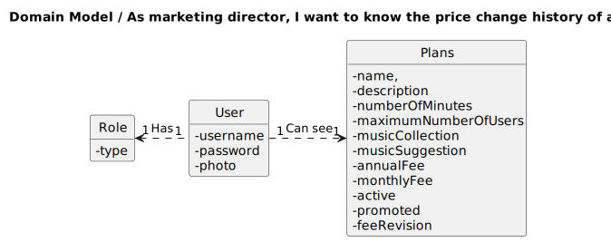

## 1. Requirements Engineering

### 1.1. User Story Description

As marketing director, I want to know the price change history of a plan

### 1.2. Customer Specifications and Clarifications 

**From the specifications document:**

  n/a

**From the client clarifications:**

>Question:
> 
>Bom dia,
>No work package quando é feito uma alteração ao preço do plan (As marketing director, I want to change the pricing of a plan) é preciso também guardar a data de alteração e depois mostrar (As marketing director, I want to know the price change history of a plan)?
>
>Cumprimentos

> Answer: 
>boa tarde, sim

### 1.3. Acceptance Criteria

All user stories have the following acceptance criteria:
* Analysis and design documentation
* OpenAPI specification
* POSTMAN collection with sample requests for all the use cases with tests.

### 1.4. Found out Dependencies

* Plan needs to exist.

### 1.5 Input and Output Data

**Input Data:**

* Typed data:
  * name
  
* Selected data:
  * n/a

**Output Data:**

* Success of operation - Will show the price change history of a plan
* In-success of operation - Error message that explains the mistake
### 1.6. System Sequence Diagram (SSD)

### 1.7 Other Relevant Remarks

## 2. OO Analysis

### 2.1. Relevant Domain Model Excerpt 

### 2.2. Other Remarks

n/a

## 3. Design - User Story Realization 

### 3.1. Rationale
n/a
### Systematization ##

According to the taken rationale, the conceptual classes promoted to software classes are:

* Plans
* Active
* AnnualFee
* Description
* MaximumNumberOfUsers
* MonthlyFee
* MusicCollection
* MusicSuggestion
* Name
* NumberOfMinutes
* Promoted
* FeeRevision

Other software classes (i.e. Pure Fabrication) identified:
* PlansController
* PlansRepository
* PlansService
* PlansServiceImpl
* FeeRevisionViewMapper
* FeeRevisionView

## 3.2. Sequence Diagram (SD)

## 3.3. Class Diagram (CD)

# 4. Tests
Test starts with creating a new Plan. Then changing his fees.
Then validate the results.

        @Test
        public void feeHistoryTest() {
          Name name = new Name();
          name.setName("Plan Name");

          Description description = new Description();
          description.setDescription("Plan Description");

          NumberOfMinutes numberOfMinutes = new NumberOfMinutes();
          numberOfMinutes.setNumberOfMinutes("100");

          MaximumNumberOfUsers maximumNumberOfUsers = new MaximumNumberOfUsers();
          maximumNumberOfUsers.setMaximumNumberOfUsers(5);

          MusicCollection musicCollection = new MusicCollection();
          musicCollection.setMusicCollection(10);

          MusicSuggestion musicSuggestion = new MusicSuggestion();
          musicSuggestion.setMusicSuggestion("personalized");

          AnnualFee annualFee = new AnnualFee();
          annualFee.setAnnualFee(150.00);

          MonthlyFee monthlyFee = new MonthlyFee();
          monthlyFee.setMonthlyFee(15.00);

          Active active = new Active();
          active.setActive(true);

          Promoted promoted = new Promoted();
          promoted.setPromoted(false);

          Plans plan = new Plans(name, description, numberOfMinutes, maximumNumberOfUsers,
                musicCollection, musicSuggestion, annualFee, monthlyFee, active, promoted);

          FeeRevision one = new FeeRevision(100.00, 10.00,"chico");

          plan.getFeeRevisions().add(one);

          when(plansRepository.findByName_Name(plan.getName().getName())).thenReturn(Optional.of(plan));

          plansRepository.save(plan);

          List<FeeRevision> result = plansService.history(plan.getName().getName());

          assertNotNull(result);
          assertEquals(2, result.size());
          assertEquals(150.00, result.get(0).getAnnualFee());
          assertEquals(15.00, result.get(0).getMonthlyFee());
          assertEquals(100.00, result.get(1).getAnnualFee());
          assertEquals(10.00, result.get(1).getMonthlyFee());
        }

        @Test
          public void Test_PlanDoesNotExist() {
          String planName = "Test_PlanDoesNotExist";
          assertThrows(IllegalArgumentException.class, () -> plansService.history(planName));
        }
# 5. Observations

* To follow the principle of Information expert the Class Plans was divided in others 11 Classes. 

