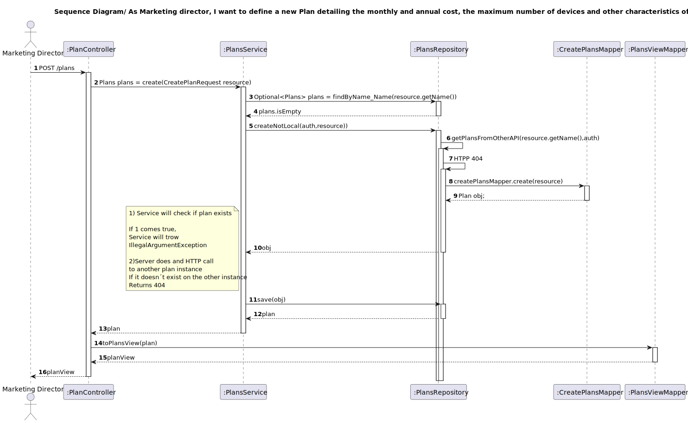
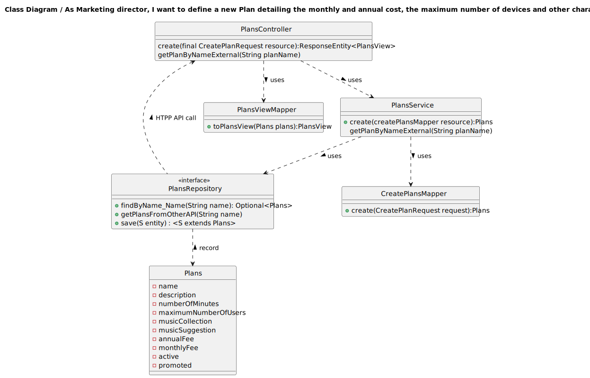

## 1. Requirements Engineering

### 1.1. User Story Description

As Marketing director, I want to define a new Plan detailing the monthly and annual cost, the maximum number of devices and other characteristics of the plan

### 1.2. Customer Specifications and Clarifications 

**From the specifications document:**

The company offers several plans and needs the ability to create new plans to adapt to market.
Due to marketing reasons, the company wants to be able to promote a plan, 
that is, give an highlight to a certain plan, for example, 
by rendering it on the web page with a different layout that gives it 
more screen area than the others. In the previous example, 
the Gold plan is the promoted plan. Plans can also be deactivated or ceased.
A deactivated plan is one that no longer is available for subscription but
remains inforce for current active subscribers of such plan. 
A plan can only be ceased if there are no current subscribers of such plan.

**From the client clarifications:**

>Question:
>
> Bom dia,
> 
> Poderia especificar os critérios de aceitação para criar um novo plano?
> 
> Cumprimentos

> Answer:
> boa tarde,
>
>As Marketing director, I want to define a new Plan detailing the monthly and annual cost, the maximum number of devices and other characteristics of the plan
>
>the user must be able to enter the plan name, a brief description as HTML text, the monthly and annual cost of the plan, the maximum number of devices, the maximum number of collections, if it includes music suggestion, and the number of included minutes. All of this information is mandatory. The plan name must be be unique.

### 1.3. Acceptance Criteria

All user stories have the following acceptance criteria:
* Analysis and design documentation
* OpenAPI specification
* POSTMAN collection with sample requests for all the use cases with tests.

### 1.4. Found out Dependencies

* n/a

### 1.5 Input and Output Data

**Input Data:**

* Typed data:
  
* name

* description

* numberOfMinutes

* maximumNumberOfUsers

* musicCollection

* musicSuggestion

* annualFee

* monthlyFee

* active - optional 

* promoted - optional

* Selected data

  n/a
  
**Output Data:**
  
* Success of operation - Plan is created and saved
* In-success of operation - Error message that explains the mistake

### 1.6. System Sequence Diagram (SSD)

### 1.7 Other Relevant Remarks

## 2. OO Analysis

### 2.1. Relevant Domain Model Excerpt 

### 2.2. Other Remarks

n/a

## 3. Design - User Story Realization 

### 3.1. Rationale
n/a
### Systematization ##

According to the taken rationale, the conceptual classes promoted to software classes are:

* Plans
* Active
* AnnualFee
* Description
* MaximumNumberOfUsers
* MonthlyFee
* MusicCollection
* MusicSuggestion
* Name
* NumberOfMinutes
* Plans
* Promoted

Other software classes (i.e. Pure Fabrication) identified: 
* PlansController
* PlansRepository
* PlansService
* CreatePlansMapper
* PlansServiceImpl
* CreatePlanRequest
* PlansViewMapper
* PlansView
* PlansRepositoryImpl

## 3.2. Sequence Diagram (SD)

## 3.3. Class Diagram (CD)

# 4. Tests
Creating new Plan and verify all of parameters.

        private Plans createPlan(String name, boolean active, boolean promoted) {
        Name planName = new Name();
        planName.setName(name);

        Description description = new Description();
        description.setDescription("Plan Description");

        NumberOfMinutes numberOfMinutes = new NumberOfMinutes();
        numberOfMinutes.setNumberOfMinutes("100");

        MaximumNumberOfUsers maximumNumberOfUsers = new MaximumNumberOfUsers();
        maximumNumberOfUsers.setMaximumNumberOfUsers(5);

        MusicCollection musicCollection = new MusicCollection();
        musicCollection.setMusicCollection(10);

        MusicSuggestion musicSuggestion = new MusicSuggestion();
        musicSuggestion.setMusicSuggestion("personalized");

        AnnualFee annualFee = new AnnualFee();
        annualFee.setAnnualFee(100.00);

        MonthlyFee monthlyFee = new MonthlyFee();
        monthlyFee.setMonthlyFee(10.00);

        Active activeStatus = new Active();
        activeStatus.setActive(active);

        Promoted promotedStatus = new Promoted();
        promotedStatus.setPromoted(promoted);

        return new Plans(planName, description, numberOfMinutes, maximumNumberOfUsers,
                musicCollection, musicSuggestion, annualFee, monthlyFee, activeStatus, promotedStatus);
    }

    private void setupMockRepository(String planName, Plans plan, boolean hasSubscriptions) {
        when(plansRepository.findByName_Name(planName)).thenReturn(Optional.of(plan));
        when(subscriptionsRepository.existsByPlanAndUserNotNull(plan)).thenReturn(hasSubscriptions);
        when(plansRepository.save(plan)).thenReturn(plan); // Mock the save operation
        when(plansRepository.ceaseByPlan(plan, 0L)).thenReturn(1);
    }

    @ParameterizedTest
    @ValueSource(strings = { "Plan Name" })
    public void ceaseTest(String planName) {
        Plans plan = createPlan(planName, false, false);
        setupMockRepository(planName, plan, false);

        int result = plansService.cease(planName, 0L);

        assertEquals(1, result);
        verify(plansRepository).ceaseByPlan(plan, 0L);
    }

    @ParameterizedTest
    @ValueSource(strings = { "Invalid Plan" })
    public void ceaseTest_InvalidPlan(String planName) {
        when(plansRepository.findByName_Name(planName)).thenReturn(Optional.empty());

        assertThrows(EntityNotFoundException.class, () -> plansService.cease(planName, 0L));
    }

    @ParameterizedTest
    @ValueSource(strings = { "Active Plan", "Promoted Plan" })
    public void ceaseTest_ActiveOrPromotedPlan(String planName) {
        Plans plan = createPlan(planName, true, true);
        setupMockRepository(planName, plan, false);

        assertThrows(IllegalArgumentException.class, () -> plansService.cease(planName, 0L));
    }

    @ParameterizedTest
    @ValueSource(strings = { "Plan with Subscriptions" })
    public void ceaseTest_ActiveSubscriptions(String planName) {
        Plans plan = createPlan(planName, false, false);
        setupMockRepository(planName, plan, true);

        assertThrows(IllegalArgumentException.class, () -> plansService.cease(planName, 0L));
    }
# 5. Observations
* To follow the principle of Information expert the Class Plans was divided in others 10 Classes. 
* It´s created two instances of the Plan. The first one runs on localhost:8081 and the second at the localhost:8090.
* There is one  Database(DB) associated with which instances of Plan created.
* It makes an HTTP API call to the other instance to confirm the Plan doesn´t already exists. This guarantees that uniqueness in the all the DBs 

