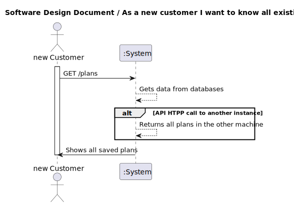
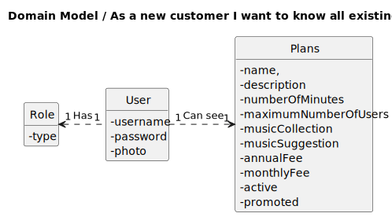
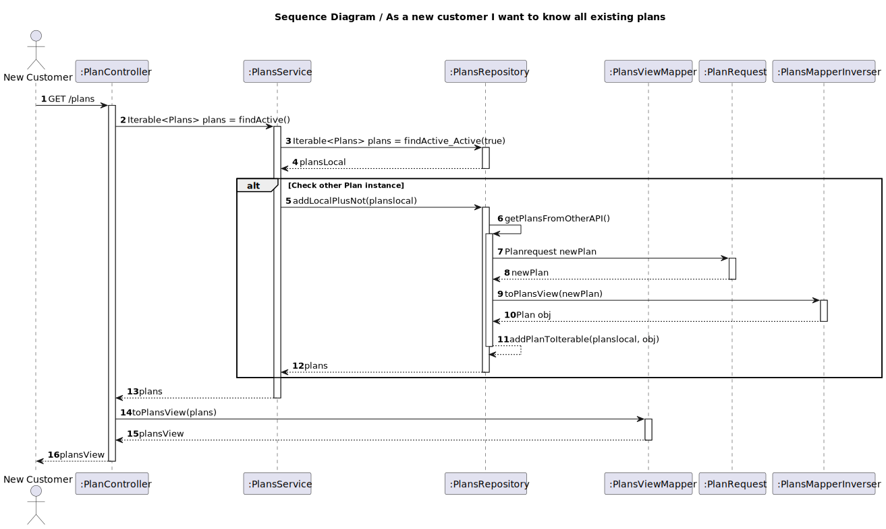
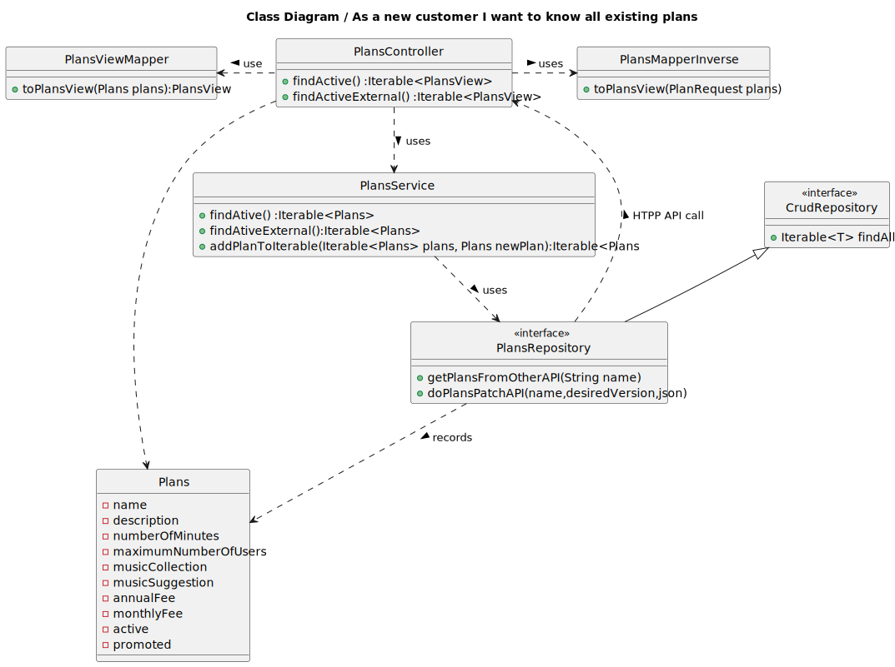

## 1. Requirements Engineering

### 1.1. User Story Description

As a new customer I want to know all existing plans

### 1.2. Customer Specifications and Clarifications 

**From the specifications document:**

  n/a

**From the client clarifications:**

>Question:
> 
> Boa tarde, na US6, quais devem ser as informações do plano que devem ser mostradas ao cliente?
>Assumo que sejam:
>
>-Preço Anual, Preço Mensal, Número de minutos, Nº Max Dispositivos, Nº Coleções musicas, Recomendações musicais
>
>Devo acrescentar algum?

> Answer:
> boa tarde, deve também mostrar se é um plano promovido ou não

>Question:
>Bom dia,
>
>para o us 6 ("As a new customer I want to know all existing plans") queria saber se o cliente só quer mostrar os planos ativos ou todos os planos que existem sem nenhuma condição.
>
>Cumprimentos.
 
>Answer:
> bom dia,
> apenas os planos ativos

### 1.3. Acceptance Criteria

All user stories have the following acceptance criteria:
* Analysis and design documentation
* OpenAPI specification
* POSTMAN collection with sample requests for all the use cases with tests.

### 1.4. Found out Dependencies

* n/a

### 1.5 Input and Output Data

**Input Data:**

* Typed data:
  * n/a
  
* Selected data:
  * n/a

**Output Data:**

* Success of operation - All the active plans in databases are showed
* In-success of operation - Error message that explains the mistake
### 1.6. System Sequence Diagram (SSD)

### 1.7 Other Relevant Remarks

## 2. OO Analysis

### 2.1. Relevant Domain Model Excerpt 

### 2.2. Other Remarks

n/a

## 3. Design - User Story Realization 

### 3.1. Rationale
n/a
### Systematization ##

According to the taken rationale, the conceptual classes promoted to software classes are:

* Plans
* Active
* AnnualFee
* Description
* MaximumNumberOfUsers
* MonthlyFee
* MusicCollection
* MusicSuggestion
* Name
* NumberOfMinutes
* Plans
* Promoted

Other software classes (i.e. Pure Fabrication) identified: 
* PlansController
* PlansRepository
* PlansService
* PlansServiceImpl
* PlansViewMapper
* PlansView
* CrudRepository

## 3.2. Sequence Diagram (SD)

## 3.3. Class Diagram (CD)

# 4. Tests
Test starts with creating two Plans. One is active the other is detective.
Then use the service function to get all active plans and verify if the result is only one.

        @Test
        public void findActive() {
        // Create test data
        Name name = new Name();
        name.setName("Plan Name");

        Description description = new Description();
        description.setDescription("Plan Description");

        NumberOfMinutes numberOfMinutes = new NumberOfMinutes();
        numberOfMinutes.setNumberOfMinutes("100");

        MaximumNumberOfUsers maximumNumberOfUsers = new MaximumNumberOfUsers();
        maximumNumberOfUsers.setMaximumNumberOfUsers(6);

        MusicCollection musicCollection = new MusicCollection();
        musicCollection.setMusicCollection(10);

        MusicSuggestion musicSuggestion = new MusicSuggestion();
        musicSuggestion.setMusicSuggestion("personalized");

        AnnualFee annualFee = new AnnualFee();
        annualFee.setAnnualFee(100.00);

        MonthlyFee monthlyFee = new MonthlyFee();
        monthlyFee.setMonthlyFee(10.00);

        Promoted promoted = new Promoted();
        promoted.setPromoted(false);

        Active active = new Active();
        active.setActive(true);

        Active inactive = new Active();
        inactive.setActive(false);

        Plans activePlan = new Plans(name, description, numberOfMinutes, maximumNumberOfUsers,
                musicCollection, musicSuggestion, annualFee, monthlyFee, active, promoted);

        Plans inactivePlan = new Plans(name, description, numberOfMinutes, maximumNumberOfUsers,
                musicCollection, musicSuggestion, annualFee, monthlyFee, inactive, promoted);

        List<Plans> plansList = new ArrayList<>();
        plansList.add(activePlan);

        when(plansRepository.findByActive_Active(true)).thenReturn(Collections.singleton(activePlan));

        plansList.add(inactivePlan);

        Iterable<Plans> result = plansService.findAtive();
        assertNotNull(result);

        List<Plans> resultList = new ArrayList<>();
        result.forEach(resultList::add);

        assertEquals(1, resultList.size());
        assertTrue(resultList.get(0).getActive().getActive());
    }

# 5. Observations

* To follow the principle of Information expert the Class Plans was divided in others 10 Classes.
* It´s created two instances of the Plan. The first one runs on localhost:8081 and the second at the localhost:8090.
* There is one  Database(DB) associated with which instances of Plan created.
* It makes an HTTP API call to the other instance to confirm the Plan doesn´t already exists. This guarantees that uniqueness in the all the DBs.  

