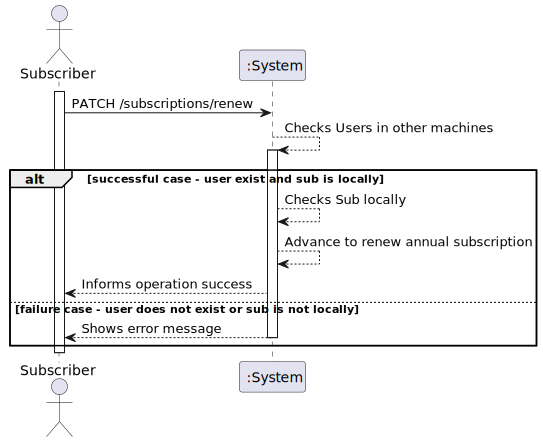
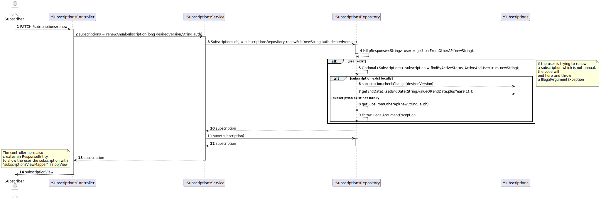
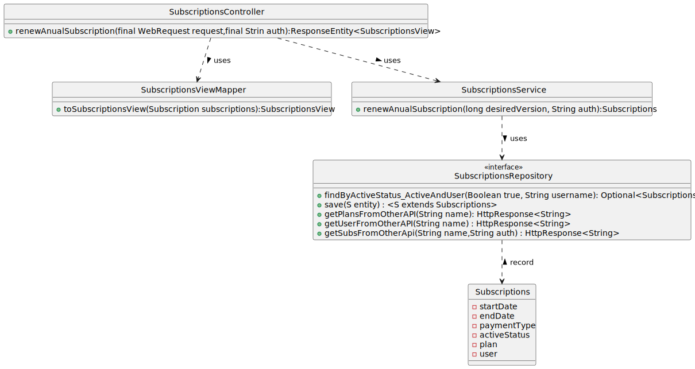

WP#2B – Subscriptions

## 1. Requirements Engineering

### 1.1. User Story Description

As subscriber I want to renew my annual subscription

### 1.2. Customer Specifications and Clarifications 

**From the specifications document:**

A customer can subscribe to the service by selecting a plan and paying for the annual or monthly fee.

**From the client clarifications:**

**1st Question**

>Question: Tendo em conta que a US23 - "As subscriber I want to renew my annual subscription" é a unica que renova subscrições, assumindo que defino a data de fim de subscrição no momento da subscrição, não existe forma de renovar as subscrições mensais? ou assumo que as subscrições mensais são sempre renovadas e apenas defino uma data de fim no momento em que o subscriber cancela?

> Answer: No caso das subscrições anuais, assume-se que terão como data de término os 12 meses após a subscrição/renovação

### 1.3. Acceptance Criteria

All user stories have the following acceptance criteria:
* Analysis and design documentation
* OpenAPI specification
* POSTMAN collection with sample requests for all the use cases with tests
* Proper handling of concurrent access.

### 1.4. Found out Dependencies

* Subscriptions

### 1.5 Input and Output Data

**Input Data:**

* Typed data:
* Selected data:
  * Subscriptions
  
**Output Data:**

* (In)Success of operation

### 1.6. System Sequence Diagram (SSD)

### 1.7 Other Relevant Remarks

## 2. OO Analysis

### 2.1. Relevant Domain Model Excerpt 

### 2.2. Other Remarks

n/a

## 3. Design - User Story Realization 

### 3.1. Rationale
n/a
### Systematization ##

According to the taken rationale, the conceptual classes promoted to software classes are:
* ActiveStatus
* EndDate
* PaymentType
* StartDate
* Subscriptions
Other software classes (i.e. Pure Fabrication) identified: 
* SubscriptionsController
* SubscriptionsRepository
* SubscriptionsService
* SubscriptionsServiceImpl
* SubscriptionsViewMapper
* SubscriptionsView

## 3.2. Sequence Diagram (SD)

## 3.3. Class Diagram (CD)

# 4. Tests

n/a

# 5. Observations

To follow the principle of Information expert the Class Subscriptions was divided in others 4 Classes. 

