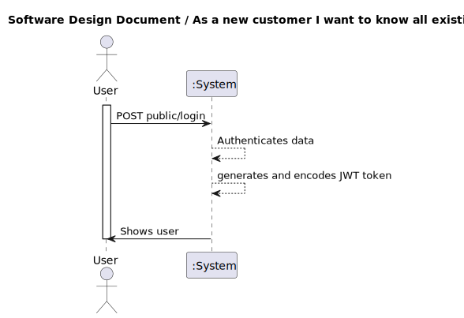
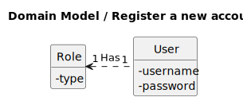
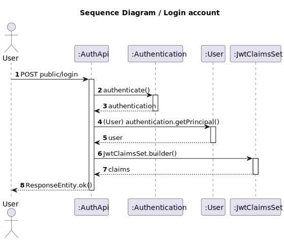
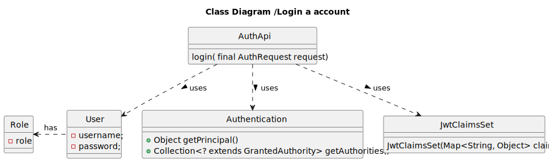

## 1. Requirements Engineering

### 1.1. User Story Description

As a user i want to login an account.

### 1.2. Customer Specifications and Clarifications

**From the specifications document:**

n/a

**From the client clarifications:**

* N/A

### 1.3. Acceptance Criteria

All user stories have the following acceptance criteria:
* Analysis and design documentation
* OpenAPI specification
* POSTMAN collection with sample requests for all the use cases with tests.

### 1.4. Found out Dependencies

* N/A

### 1.5 Input and Output Data

**Input Data:**

* Typed data:
    * N/A

* Selected data:
    * N/A

**Output Data:**

* Success of operation - The user is showed and jwt token generated
* In-success of operation - Error message that explains the mistake
### 1.6. System Sequence Diagram (SSD)

### 1.7 Other Relevant Remarks

## 2. OO Analysis

### 2.1. Relevant Domain Model Excerpt

### 2.2. Other Remarks

n/a

## 3. Design - User Story Realization

### 3.1. Rationale
n/a
### Systematization ##

According to the taken rationale, the conceptual classes promoted to software classes are:

* User
* Role

Other software classes (i.e. Pure Fabrication) identified:
* UserController
* UserRepository
* UserService
* UserServiceImpl
* UserViewMapper
* UserView
* CrudRepository

## 3.2. Sequence Diagram (SD)

## 3.3. Class Diagram (CD)

# 4. Tests
* N/A

# 5. Observations

* It´s created two instances of the User. The first one runs on localhost:8083 and the second at the localhost:8092.
* There is one  Database(DB) associated with which instances of User created.
* It makes an HTTP API call to the other instance to confirm the User doesn´t already exists. This guarantees that uniqueness in the all the DBs.  

