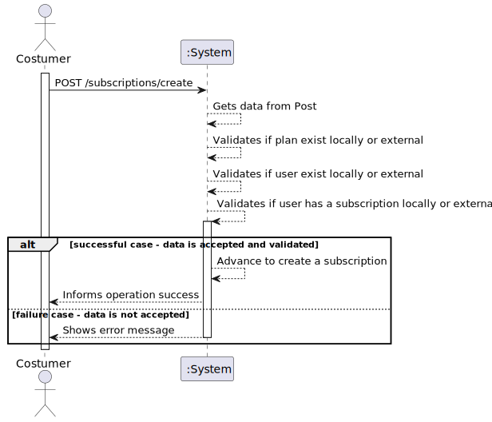
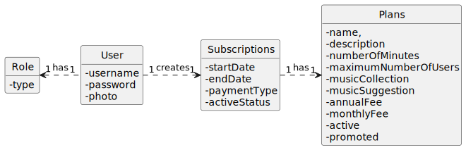
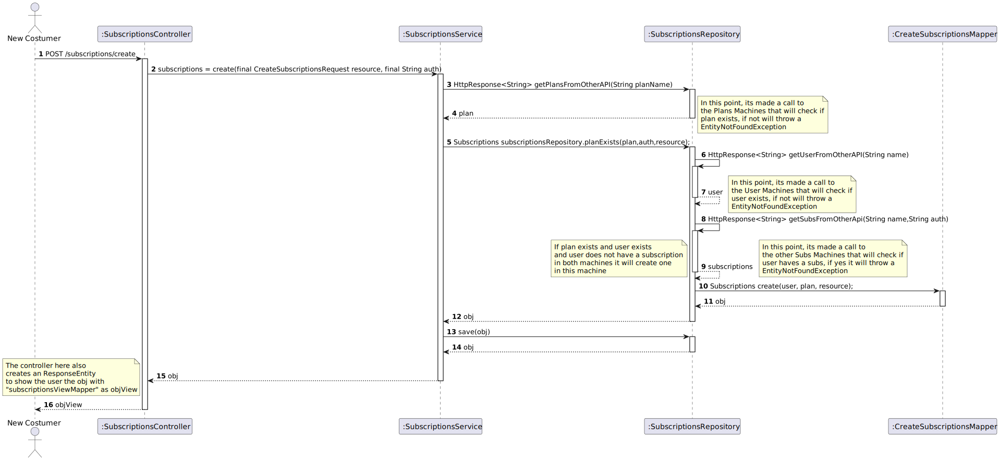
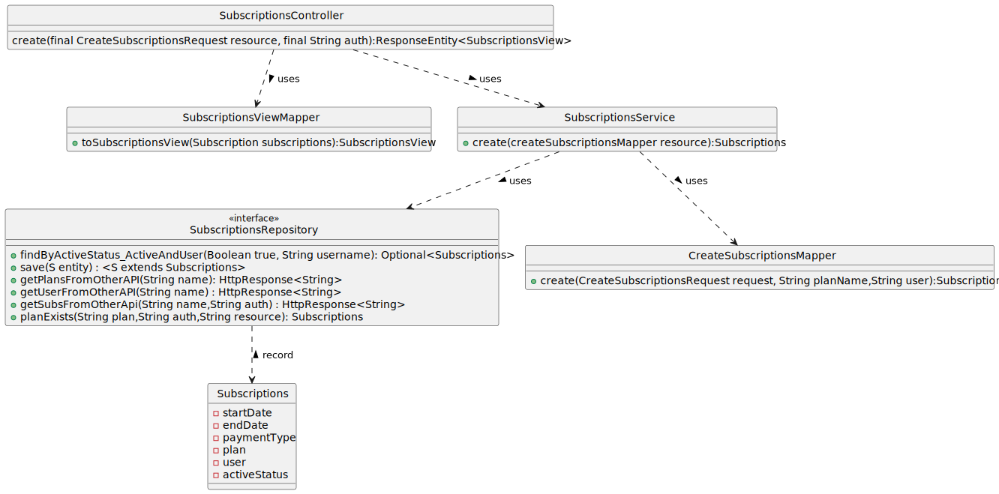

WP#2A – Subscriptions

## 1. Requirements Engineering

### 1.1. User Story Description

As a new customer I want to subscribe to a plan

### 1.2. Customer Specifications and Clarifications 

**From the specifications document:**

A customer can subscribe to the service by selecting a plan and paying for the annual or monthly fee.

**From the client clarifications:**

**1st Question**

>Question: Gostaria de saber se o cliente quando se regista fica logo com a subscrição free?

> Answer: Idealmente o registo de clientes é feito no mesmo instante da subscrição (US 7. As a new customer I want to subscribe to a plan). se por algum motivo quiserem ou necessitarem de separar o registo de utilizador da subscrição, no momento do registo o cliente não ficará com nenhum plano subscrito

**2nd Question**

>Question: Gostaria de saber quais são os campos que um novo cliente necessita preencher para efetuar uma subscrição

> Answer: Deve indicar qual o plano selecionado e a frequencia de pagamento (mensal ou anual). Se implementarem o caso de uso de subscrição e registo de utilizador em simultaneo devem introduzir os dados de identificação do utilizador: username, password, nome completo e opcionalmente uma foto/avatar

### 1.3. Acceptance Criteria

All user stories have the following acceptance criteria:
* Analysis and design documentation
* OpenAPI specification
* POSTMAN collection with sample requests for all the use cases with tests
* Proper handling of concurrent access.

### 1.4. Found out Dependencies
* n/a
### 1.5 Input and Output Data

**Input Data:**

* Typed data:
  * Payment Type
* Selected data:
  * Plan
  
**Output Data:**

* (In)Success of operation

### 1.6. System Sequence Diagram (SSD)

### 1.7 Other Relevant Remarks

## 2. OO Analysis

### 2.1. Relevant Domain Model Excerpt 

### 2.2. Other Remarks

n/a

## 3. Design - User Story Realization 

### 3.1. Rationale
n/a
### Systematization ##

According to the taken rationale, the conceptual classes promoted to software classes are:
* ActiveStatus
* EndDate
* PaymentType
* StartDate
* Subscriptions
Other software classes (i.e. Pure Fabrication) identified: 
* SubscriptionsController
* SubscriptionsRepository
* PlansRepository
* UserRepository
* SubscriptionsService
* CreateSubscriptionsMapper
* SubscriptionsServiceImpl
* CreateSubscriptionsRequest
* SubscriptionsViewMapper
* SubscriptionsView

## 3.2. Sequence Diagram (SD)

## 3.3. Class Diagram (CD)

# 4. Tests

n/a

# 5. Observations

To follow the principle of Information expert the Class Subscriptions was divided in others 4 Classes. 

