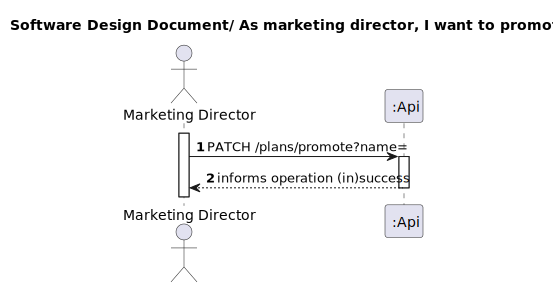
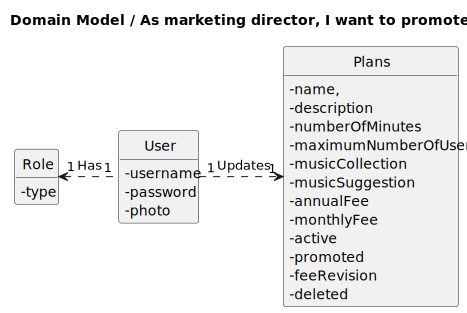
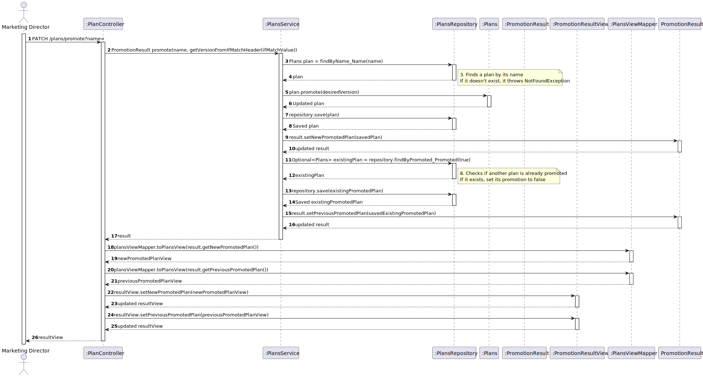
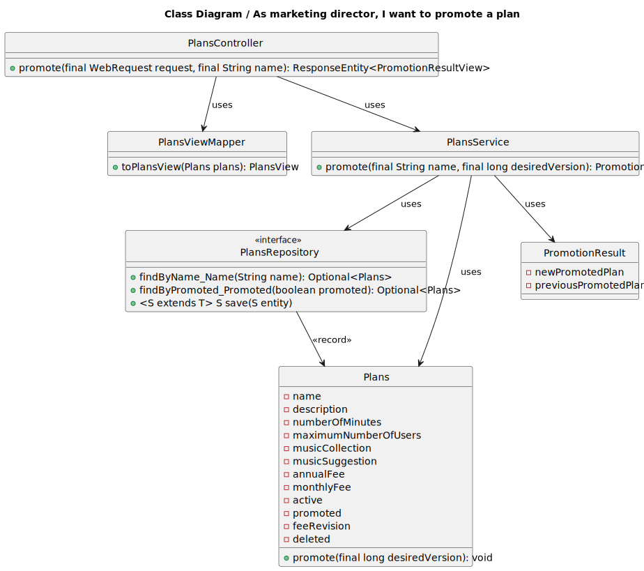

# UC20 – To promote a plan
## 1. Requirements Engineering

### 1.1. User Story Description

As marketing director, I want to promote a plan

### 1.2. Customer Specifications and Clarifications 

**From the specifications document:**

>...the company wants to be able to promote a plan, that is, 
> give an highlight to a certain plan, for example, 
> by rendering it on the web page with a different layout that gives it more screen area than the others.

**From the client clarifications:**

>Question:
> só para ter a certeza gostaria de saber se o "marketing director" é capaz de promover vários planos ou apenas exclusivamente um de cada vez, ou seja, se um plano estiver promovido os outros não podem estar.

> Answer:
> apenas um plano está promovido a cada momento

### 1.3. Acceptance Criteria

All user stories have the following acceptance criteria:
* Analysis and design documentation
* OpenAPI specification
* POSTMAN collection with sample requests for all the use cases with tests.

### 1.4. Found out Dependencies

* UC2 - As admin I want to “bootstrap” plans data. 
* UC3 - As Marketing director, I want to define a new Plan detailing the monthly and annual cost, 
the maximum number of devices and other characteristics of the plan. 

### 1.5 Input and Output Data

**Input Data:**

* Typed data:

  * name

* Selected data:

    * n/a
  
**Output Data:**

* Success of operation - Shows the plan information (new promoted plan and previous promoted plan)
* In-success of operation - Error message that explains the mistake

### 1.6. System Sequence Diagram (SSD)

### 1.7 Other Relevant Remarks

## 2. OO Analysis

### 2.1. Relevant Domain Model Excerpt 

### 2.2. Other Remarks

n/a

## 3. Design - User Story Realization 

### 3.1. Rationale
n/a
### Systematization ##

According to the taken rationale, the conceptual classes promoted to software classes are:

* Plans
* PromotionResult
* Active
* AnnualFee
* Description
* MaximumNumberOfUsers
* MonthlyFee
* MusicCollection
* MusicSuggestion
* Name
* NumberOfMinutes
* Promoted
* FeeRevision
* Deleted

Other software classes (i.e. Pure Fabrication) identified:
* PlansController
* PlansRepository
* PlansService
* PlansServiceImpl
* PlanViewMapper
* PlanView
* PromotionResultView
## 3.2. Sequence Diagram (SD)

## 3.3. Class Diagram (CD)

# 4. Tests
* Repository tests

      @Test
      void testFindByName() {
      // Mock the repository method
      Plans plan = createPlan("Plan Name");
      when(plansRepository.findByName_Name("Plan Name")).thenReturn(Optional.of(plan));

        // Call the method
        Optional<Plans> result = plansRepository.findByName_Name("Plan Name");

        // Verify the result
        assertEquals(Optional.of(plan), result);
        verify(plansRepository).findByName_Name("Plan Name");
      }

      @Test
      void testFindByActive() {
      Plans plan = createPlan("Plan Name");
      when(plansRepository.findByName_Name("Plan Name")).thenReturn(Optional.of(plan));
      when(plansRepository.save(Mockito.any(Plans.class))).thenReturn(plan);
      plansRepository.save(plan);
      Iterable<Plans> result = plansRepository.findByActive_Active(true);
      assertEquals(plan, result);
      verify(plansRepository).findByActive_Active(true);
      }

* Service tests

      @Test
      public void promoteTest() {
      String planName = "Plan Name";
      Plans plan = createPlan(planName, true, false);
      setupMockRepository(planName, plan);

      PromotionResult result = plansService.promote(planName, 0L);

      assertNotNull(result.getNewPromotedPlan());
      assertTrue(result.getNewPromotedPlan().getPromoted().getPromoted());
      assertNull(result.getPreviousPromotedPlan());
      verify(plansRepository).save(plan);
      }
  
      @Test
      public void promoteTest_InactivePlan() {
      String planName = "Inactive Plan";
      Plans plan = createPlan(planName, false, false);
      setupMockRepository(planName, plan);
  
      assertThrows(IllegalArgumentException.class, () -> plansService.promote(planName, 0L));
      }
  
      @Test
      public void promoteTest_AlreadyPromotedPlan() {
      String planName = "Promoted Plan";
      Plans plan = createPlan(planName, true, true);
      setupMockRepository(planName, plan);
  
      assertThrows(IllegalArgumentException.class, () -> plansService.promote(planName, 0L));
      }
  
      @Test
      public void promoteTest_ExistingPromotedPlan() {
      String planName = "Plan Name";
      Plans plan = createPlan(planName, true, false);
      setupMockRepository(planName, plan);
  
      Plans existingPromotedPlan = createPlan("Existing Promoted Plan", true, true);
      when(plansRepository.findByPromoted_Promoted(true)).thenReturn(Optional.of(existingPromotedPlan));
  
      PromotionResult result = plansService.promote(planName, 0L);
  
      assertTrue(result.getNewPromotedPlan().getPromoted().getPromoted());
      assertEquals(existingPromotedPlan, result.getPreviousPromotedPlan());
      verify(plansRepository).save(plan);
      verify(plansRepository).save(existingPromotedPlan);
      }

# 5. Observations

* To follow the principle of Information expert the Class Plans was divided in others 11 Classes. 

