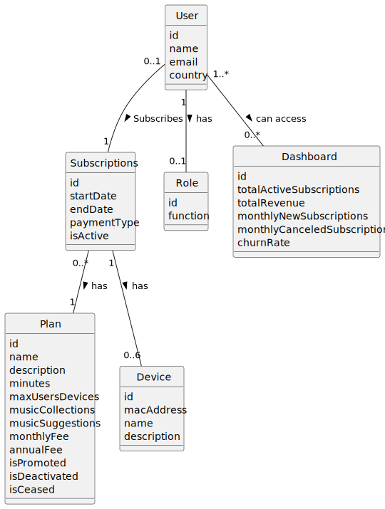

# OO Analysis #

The construction process of the domain model is based on the client specifications, especially the nouns (for _concepts_) and verbs (for _relations_) used. 

## Rationale to identify domain conceptual classes ##
To identify domain conceptual classes, start by making a list of candidate conceptual classes inspired by the list of categories suggested in the book "Applying UML and Patterns: An Introduction to Object-Oriented Analysis and Design and Iterative Development". 

### _Conceptual Class Category List_ ###

**Business Transactions**

* Music Streaming Transaction

---

**Transaction Line Items**

* Streamed Music Tracks

---

**Product/Service related to a Transaction or Transaction Line Item**

*  n/a

---

**Transaction Records**

* Metrics

---  

**Roles of People or Organizations**

* Subscribers
* Admin
* Marketing Director
* Product Manager

---

**Places**

* n/a

---

**Noteworthy Events**

* n/a

---

**Physical Objects**

* Devices

**Descriptions of Things**

* n/a

---

**Catalogs**

* n/a

---

**Containers**

*  n/a

---

**Elements of Containers**

* n/a

---

**Organizations**

* ACME

---

**Other External/Collaborating Systems**

* n/a

**Records of finance, work, contracts, legal matters**

*  n/a

---

**Financial Instruments**

* n/a

---

**Documents mentioned/used to perform some work/**

* n/a
---

###**Rationale to identify associations between conceptual classes**

An association is a relationship between instances of objects that indicates a relevant connection and that is worth of remembering, or it is derivable from the List of Common Associations: 

+ **_A_** is physically or logically part of **_B_**
+ **_A_** is physically or logically contained in/on **_B_**
+ **_A_** is a description for **_B_**
+ **_A_** known/logged/recorded/reported/captured in **_B_**
+ **_A_** uses or manages or owns **_B_**
+ **_A_** is related with a transaction (item) of **_B_**
+ etc.

| Concept (A) 		|  Association   	  |  Concept (B) |
|----------	   		|:-----------------:|------:       |
| 	User	|  subscribes to 	  |  Music Streaming Service |
| 	User	|   searches for	   | Song/Artist/Album  |
| 	User	|    	   creates    |  Playlist |
| 	Song	|   	 belongs to    |  Album |
| 	Song	|    	belongs to    |  Artist |
| 	Artist	|     creates	      | Song  |
| 	Artist	| creates	          | Album  |
| 	Playlist	|     contains	     | Song  |
| 	Music Streaming Service	|     provides	     | Song/Artist/Album/Playlist  |

## Domain Model

