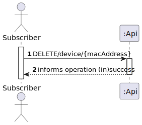
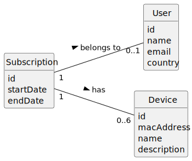
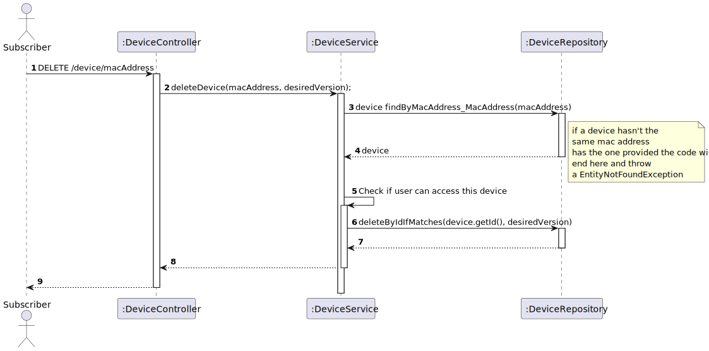
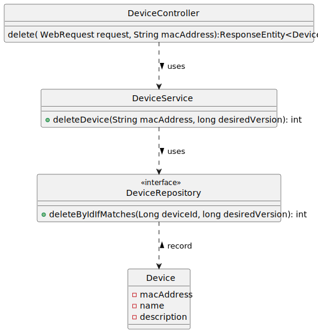

# UC12 – To remove a device from my subscription

## 1. Requirements Engineering

### 1.1. User Story Description

As subscriber, I want to remove a device from my subscription.

### 1.2. Customer Specifications and Clarifications

**From the specifications document:**
>A customer can subscribe to the service by selecting a plan and paying for the annual or monthly fee. This
entitles the customer to listen to up to n minutes of music on the number of devices according to the plan
they selected.

**From the client clarifications:**

>n/a
>
>
>
### 1.3. Acceptance Criteria

* Analysis and design documentation
* OpenAPI specification
* POSTMAN collection with sample requests for all the use cases with tests
* Proper handling of concurrent access

### 1.4. Found out Dependencies

* UC11 - "As a subscriber, I want to add a new device to my subscription".
  A customer must already have created a device.

### 1.5 Input and Output Data

**Input Data:**

* Typed data:
    * mac address
* Selected data:
    * n/a

**Output Data:**

* (In)Success of operation

### 1.6. System Sequence Diagram (SSD)

### 1.7 Other Relevant Remarks

n/a

## 2. OO Analysis

### 2.1. Relevant Domain Model Excerpt

### 2.2. Other Remarks

n/a

## 3. Design - User Story Realization

### 3.1. Rationale
n/a
### Systematization ##

According to the taken rationale, the conceptual classes promoted to software classes are:

* Device
* Subscription
* User

Other software classes (i.e. Pure Fabrication) identified:

* DeviceController
* DeviceRepository
* DeviceService
* DeviceServiceImpl

## 3.2. Sequence Diagram (SD)

First model:

## 3.3. Class Diagram (CD)

**Note: private attributes and/or methods were omitted.**

# 4. Tests
* n/a
# 5. Observations
* n/a 

